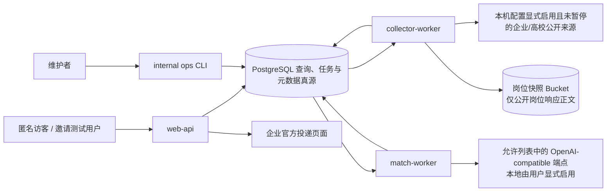

# 系统架构

## 1. 已决定的 MVP 架构

工程 MVP 采用一个模块化单体代码库和三个独立运行进程：

```text
web-api
collector-worker
match-worker
```

运营动作通过同一代码库中的 `internal ops CLI` 完成，不部署公共管理端。PostgreSQL 是唯一查询、任务和元数据真源，承担业务数据、任务表、版本、审计和 MVP 查询；独立岗位快照 Bucket 只保存原始公开岗位响应正文，绝不保存用户简历或其他用户数据。不部署 Redis/Celery、独立搜索、向量库、Playwright 或其他对象存储用途。PDF/DOCX 只按 ADR-0012 应用层加密暂存在 PostgreSQL 并由 `match-worker` 隔离解析。

这一形态兼顾两点：领域模块在代码和数据上保持边界，高风险采集与用户匹配在运行时使用不同身份和权限；同时不为尚未出现的规模问题引入微服务和分布式一致性成本。

> 2026-07-29 R1 实现状态：上述内容仍是已接受的目标架构，不等于全部运行时边界已经落地。当前已有独立 `web-api` 与 `match-worker` 入口，采集仍主要由受控 CLI 执行；数据库角色、受限任务函数、独立 collector 身份和 OpenAPI artifact 尚未完成。收口方案见 [R1 架构审视](evidence/r1/architecture-review-2026-07-29.md)与 [ADR-0023 提案](decisions/0023-enforce-runtime-and-database-role-boundaries.md)。

> 2026-08-02 后续实现状态：按 [ADR-0026](decisions/0026-local-automatic-source-refresh.md) 已落地独立 `collector-worker` 入口、本机总开关、PostgreSQL 到期调度与 `scheduled` 运行；只有本机配置显式启用且未暂停的确定性来源可以定时刷新。ADR-0023 的数据库角色拆分、独立数据库身份与受限函数，以及 OpenAPI artifact 仍未实施，不能把进程入口落地写成最小权限边界已经完成。

## 2. 系统上下文



用户反馈只追加到反馈与审计数据，并进入人工复核或后续评估。反馈不能直接修改岗位版本、用户事实、匹配规则、当前三轴结果或用户决定。

## 3. 领域边界与数据所有权

### 3.1 来源控制 `source-control`

拥有 `SourcePolicy`、来源证明、精确采集/申请目标、适配器版本、审核状态和暂停机制。只有 `internal ops CLI` 能批准或改变政策状态。

### 3.2 采集 `ingestion`

拥有 `CrawlTask`、`CrawlRun`、`RawJobSnapshot` 元数据、`SourceJobRecord` 和 `SourceJobRevision`。原始响应正文存入岗位快照 Bucket；该领域只处理公开来源数据，不接触任何 owner 用户数据。

### 3.3 岗位目录 `catalog`

拥有稳定岗位身份、不可变 `PublishedJobVersion`、当前活动版本指针、发布/有效状态和 `JobRequirementSet`。用户查询只读取已经发布的版本。

### 3.4 用户画像 `profile`

拥有邀请会话、`owner_id`、加密临时简历文档、`ProfileFact`、`JobPreference`、`ResumeEvidence` 及其不可变修订、保留期限和删除状态。

### 3.5 匹配 `matching`

拥有 `MatchRun`、`RecommendationRun`、`ResumeTailoringRun`、导出记录、规则/词典/解释模板版本、资格/证据/偏好三轴结果和 AI 元数据。它不生成匹配度百分比，也不修改来源、岗位版本、用户确认事实或用户决定。

### 3.6 决策、反馈与审计 `decision-feedback-audit`

拥有用户主动更新的 `JobDecision`（未决定、已保存、准备投递、已投递、已放弃）、官方链接点击、自报投递、岗位失效、结果反驳、管理员变更和删除结果。数据以最小、追加方式保存，不把三轴结果或单次反馈自动转成用户决定或生产规则。

## 4. PostgreSQL 与岗位快照 Bucket

MVP 使用一个 PostgreSQL 16 实例（本地由 Docker Desktop 运行，后续 Alpha 才评估托管实例），通过 schema 和数据库角色隔离：

| Schema | 主要内容 | 写入者 | 读取者 |
|---|---|---|---|
| `source_control` | 来源政策和审批版本 | ops CLI | collector、ops CLI |
| `task_queue` | 任务信封、类型、幂等键、租约、心跳和最小 payload 引用 | web-api、collector/match 定时入口、ops CLI 通过入队函数；Worker 通过状态函数 | 按任务类型隔离的 claim/complete 函数；Worker 不读基表 |
| `ingestion` | 采集运行、快照对象元数据、来源修订 | collector；ops CLI 仅通过受限人工导入函数写 `import_mode=manual` 修订 | collector、ops CLI |
| `catalog` | 发布岗位版本和要求集 | collector/受控发布操作 | web-api、match、ops CLI |
| `profile` | 会话、owner、事实、偏好和证据 | web-api、match | owner 作用域的 web-api/match |
| `matching` | 匹配运行、推荐运行、简历优化和导出结果 | match | owner 作用域的 web-api/match |
| `decision_feedback_audit` | 用户决定、最小产品事件和安全/管理审计 | owner 作用域的 web-api、各受控主体 | owner 作用域的 web-api、ops CLI/受限审计角色 |

数据库约束承担核心一致性：

- 来源岗位、快照哈希、版本内容哈希和任务幂等键使用唯一约束。
- `task_queue.task_type` 只允许 `crawl/resume_analysis/match_run/recommendation_run/resume_tailoring/resume_export/owner_deletion`；受限函数保证 collector 只能领取 `crawl`，match 只能领取用户任务，并只返回该类型所需字段。
- `crawl` 任务必须含 `source_id` 且禁止含 `owner_id/owner_epoch`；所有用户任务必须含 `owner_id + owner_epoch` 且禁止含 `source_id`。数据库 CHECK/触发器与受限入队函数共同执行该互斥约束。
- 外键固定 `PublishedJobVersion -> JobRequirementSet -> MatchRun -> RecommendationRun/ResumeTailoringRun` 版本链。`MatchRun` 必须引用事实/偏好/证据修订、规则、词典和模板；AI 实际参与时固定提示词和模型版本。`JobDecision` 关联稳定岗位 ID、自己的修订号及可选 `match_run_id`，不属于系统匹配输出。
- 用户表均含 `owner_id`，查询通过服务端会话派生 owner，不接受客户端指定。
- 邀请交换固定 `owner_expires_at`；所有 owner 数据、任务载荷和正常会话的过期时间不得晚于它，新修订不能续期。
- 用户任务固定领取时的 `owner_epoch`；任何结果写入都在同一事务确认 owner 未删除、未到期且 epoch 未变化。删除事务递增 epoch 并取消待处理用户任务，使已领取旧任务的迟到写入失效。
- 活动版本用受约束指针切换；历史版本不可修改。
- 过期时间和删除墓碑是数据模型的一部分，不依赖临时脚本记忆。

岗位快照 Bucket 不是查询真源：PostgreSQL 中的 `RawJobSnapshot` 只保存 `object_key`、`content_hash`、`byte_size`、`content_type` 等元数据。`collector-worker` 依据来源 ID 与内容哈希生成确定性对象键，只能读写其专用前缀；`web-api` 和 `match-worker` 没有 Bucket 凭据或读取权限。

采集进程先校验响应大小/类型并将正文上传 Bucket，通过哈希和大小校验后，才在 PostgreSQL 事务中提交快照元数据、来源修订和候选版本。上传成功但事务未提交的无引用对象在满 24 小时后清理；对象缺失、不可读或哈希不一致时禁止发布对应岗位版本。用户 PDF/DOCX/文本只在 PostgreSQL 中应用层加密暂存，由无网络、有限资源的解析子进程处理；经历证据确认后立即删除，未完成或异常时也最长不超过 24 小时，绝不进入岗位快照 Bucket。

## 5. 运行主体与能力

### 5.1 `web-api`

- 提供岗位列表、详情、邀请交换、画像确认、匹配任务、结果、反馈和删除 API。
- 匿名请求只能读取已发布岗位。
- 邀请会话请求只能访问当前 `owner_id` 的用户对象。
- 不跨请求缓存 owner 事实、证据、匹配或决定；每次读取重新校验会话、墓碑和 `owner_expires_at`。
- 可以向 PostgreSQL 任务表入队，不能自己抓取外部 URL 或调用模型。
- 无来源审批、岗位快照 Bucket、采集凭据和模型密钥权限。

### 5.2 `collector-worker`

- 从 PostgreSQL 领取 `CrawlTask`，读取与本机配置版本一致、显式启用且未暂停的 `SourcePolicy`；计划刷新授权不等于来源获准公开。
- 只向精确允许的采集目标出站。
- 只用 collector 专用身份和前缀读写岗位快照 Bucket；先上传并校验正文，再写入运行、快照元数据、来源修订和待发布岗位版本。
- 无 `profile`、`matching` 和模型权限；不能修改来源审批。

### 5.3 `match-worker`

- 从 PostgreSQL 领取简历解析、匹配、推荐、简历优化、DOCX 导出或删除任务。
- 只读取任务指定 owner 的用户修订和已发布岗位版本。
- 写入新的 `MatchRun`、`RecommendationRun`、`ResumeTailoringRun` 和导出结果，不覆盖历史；不能代替用户更新 `JobDecision`。
- 领取已持久化墓碑的 owner 删除任务，通过校验任务 owner、墓碑和 fencing token 的受限幂等数据库函数清理 `profile`、`matching`、owner 决策/事件、任务载荷与持久派生数据；没有有效墓碑时函数拒绝执行。MVP 不建立跨请求 owner 缓存。
- 定时入口通过受限函数选择已经到达 `owner_expires_at` 的 owner；函数原子写到期墓碑、递增 `owner_epoch`、取消旧任务并入队 `owner_deletion`，不把其他 owner 内容返回给 Worker。
- 同一定时入口清理达到 `raw_resume_expires_at` 的原文并取消关联解析任务；解析结果提交同时校验原文未删除/未到期与 `owner_epoch` 未变化，Worker 不持久化本地正文缓冲。
- 本地 AI 仅在环境允许且用户逐次显式选择后向精确批准的模型端点出站并使用独立密钥；公开环境默认关闭。
- 无采集目标、原始网页或岗位快照 Bucket 权限，也无来源管理权限。

### 5.4 `internal ops CLI`

- 通过维护者身份登记、批准、暂停来源和处理岗位复核队列。
- CLI 保留受控结构化人工导入作为采集失败回退；G2 主目录必须达到 100 家企业、1000 条可信活动实习岗位及 ADR-0027 的结构指标。人工记录必须保存来源 URL、最后核验时间、复核人和字段级证据，经过与自动采集相同的字段、投递方式、不可变版本和发布复核，并受企业 ≤20%、岗位 ≤10% 上限约束。300–500 条只作为 G2 通过后的 G1 冻结研究子集。
- 查看脱敏运行质量、删除状态和审计记录。
- 所有写操作记录原因、操作者、时间及前后值。
- 默认无简历原文读取权限，不在公网监听端口。

## 6. PostgreSQL 任务执行契约

任务采用至少一次执行语义，使用数据库任务表，不声称 exactly-once：

调度不是额外服务：`collector-worker` 的定时/命令入口（或受控 CLI）依据 `SourceRuntimeState.next_due_at` 入队 `crawl`；`match-worker` 的定时入口只通过受限函数入队到期 owner 的 `owner_deletion`。两者都使用同一任务表与进程身份。

1. API/调度器通过受限入队函数以唯一 `idempotency_key` 插入任务。
2. Worker 调用按角色和 `task_type` 固定的 claim 函数；函数内部使用行锁和 `FOR UPDATE SKIP LOCKED` 领取可用任务并写入租约和心跳，Worker 不能查询任务基表。
3. 外部调用在数据库事务外执行，结果通过输入哈希、唯一约束和版本键幂等落库。
4. 租约过期后其他 Worker 可以接管；旧 Worker 的过期写入通过租约版本/fencing token 拒绝。
5. 仅网络超时、限流和临时上游错误重试；Schema、权限和政策错误直接进入人工处理。
6. 达到 `max_attempts` 后标记 `dead` 并告警，不无限重试。

用户任务载荷不保存简历正文或证据原文，只保存 owner、受控记录 ID、修订和输入哈希；任务重试不能成为被删除正文的副本。

采集任务的完整/部分/失败语义见采集设计；匹配任务失败不删除上一可用结果。删除任务重复执行返回同一结果，不得恢复数据或删除无墓碑 owner。每次模型重试都计入成本预算。

## 7. `/v1` API 契约

所有 HTTP API 使用 `/v1` 前缀。目标是在进入 Private Alpha 前生成并评审 OpenAPI；当前仓库以 Zod 契约和路由测试为实现事实，下列为边界而非完整 Schema。

### 7.1 匿名岗位

- `GET /v1/jobs`：游标分页、结构化筛选。公开/Alpha 环境只返回已发布版本；本机 `dev/test` 由服务器固定 `catalog_scope=local_mvp`，可返回明确标识的 `pending_review` 数据，客户端不能用查询参数切换范围。
- `GET /v1/jobs/{id}`：返回稳定岗位 ID、当前 `published_job_version_id`、来源、状态和最后核验时间。

### 7.2 邀请与用户数据

- `POST /v1/invitations/exchange`：补充接口；同源引导页从 URL fragment 读取一次性令牌并放入 POST body，交换为服务端会话 Cookie，成功或失败后立即从 URL 移除令牌。
- `GET /v1/profile`：返回当前 owner 的 `owner_expires_at`、事实/偏好/证据修订摘要和五态决策队列，用于复访与数据控制；不返回简历原文，删除状态受限会话无权调用。
- `PUT /v1/profile/facts`：确认或替换当前 owner 的事实修订，携带期望修订版本。
- `PUT /v1/profile/preferences`：确认或替换当前 owner 的求职偏好修订，携带期望修订版本。
- `POST /v1/resume-analyses`：使用 `multipart/form-data` 提交一个 PDF/DOCX，或使用 JSON 提交文本；异步返回 `202 Accepted`、`analysis_id` 和结果查询地址。
- `GET /v1/resume-analyses/{analysis_id}`：查询解析状态、稳定错误码和当前 owner 的事实/证据候选，不返回已删除原文。
- `PUT /v1/profile/evidence`：确认或替换当前 owner 的经历证据修订，携带期望修订版本；当 `confirmation_complete=true` 时，证据修订与原文删除/墓碑在同一事务提交，成功响应后原文不可再读取。
- `GET /v1/profile/document`：读取当前 owner 确认后保留的最新有序 `ResumeDocumentRevision`；不恢复已删除的原文件、临时原文或旧版 v1 内容。
- `PUT /v1/profile/evidence-selection`：只接受当前文档修订中的 `sourceBlockId` 集合，由服务端派生并写入新的不可变 `ResumeEvidence v2` 修订，用于跨日复用或调整证据。
- `POST /v1/match-runs`：固定岗位版本、要求集、事实/偏好/证据修订、规则、词典和 `template_version`，异步返回 `202 Accepted`；仅在 AI 实际参与时固定提示词和模型版本。
- `GET /v1/match-runs/{match_run_id}`：读取当前 owner 的不可变运行、三轴结果与引用依据。
- `POST /v1/recommendation-runs`：固定候选岗位版本、对应匹配运行和排序策略，异步返回 `202 Accepted`。
- `GET /v1/recommendation-runs/{recommendation_run_id}`：返回确定性顺序、逐岗位理由、冲突、未知项和来源。
- `POST /v1/resume-tailorings`：为一个目标岗位创建受控 AI 或模板简历对照修改，异步返回 `202 Accepted`。
- `GET /v1/resume-tailorings/{tailoring_run_id}`：返回不可变运行、分段建议、引用和当前用户选择。
- `PUT /v1/resume-tailorings/{tailoring_run_id}/segments/{segment_id}`：接受、拒绝或编辑一个建议段，携带期望修订版本。
- `POST /v1/resume-tailorings/{tailoring_run_id}/exports`：基于用户最终选择异步生成 ATS 友好 DOCX。
- `PUT /v1/job-decisions/{job_id}`：由用户设置五态决策、结构化原因和独立隐藏状态，携带期望修订版本。
- `POST /v1/jobs/{id}/feedback`：补充接口；提交岗位失效或结果反驳的最小原因分类，不直接修改岗位或规则。
- `DELETE /v1/profile`：在同一事务写入删除墓碑、递增 `owner_epoch`、取消待处理用户任务并撤销当前 owner 对所有个人数据的访问，把会话降为最长 24 小时的仅删除状态能力，返回 `202 Accepted`、`deletion_request_id` 和状态查询地址。
- `GET /v1/profile/deletion`：仅允许删除状态能力查询当前 owner 的最小状态和稳定错误码；不能借此访问事实、证据、匹配、推荐、优化或决定。接口首次返回成功终态时撤销该能力；失败态在期限内允许重试，未成功时也最迟在能力创建 24 小时后失效。

### 7.3 通用规则

- 所有创建型接口（本草案中的全部 `POST`）必须接受 `Idempotency-Key`；同一 owner、端点和键返回同一资源或操作。会创建异步删除操作的 `DELETE /v1/profile` 同样支持该键；墓碑存在后，即使重试使用新键也返回同一活动或终态删除请求，不能创建第二条相互竞争的清理任务。
- 异步响应包含对应资源/操作 ID（如 `analysis_id`、`match_run_id` 或 `deletion_request_id`）、状态查询地址和建议轮询间隔，不返回伪完成结果。
- 所有错误使用稳定的 Problem Details 契约：`application/problem+json`（RFC 9457），至少包含稳定 `type`、`title`、`status`、`code` 和关联 ID；不泄露上游响应、SQL、堆栈或对象归属。
- 列表使用游标分页和稳定排序，不使用无限 offset。
- 更新使用版本号或 ETag 做乐观并发；冲突返回明确 `409`。
- owner 从安全 Cookie 会话派生；对象不存在和越权对外使用相同响应。
- 所有 owner 级响应使用 `Cache-Control: no-store`，不得进入共享/CDN 缓存；公开岗位响应与 owner 工作区响应不混在同一缓存表示中。
- 状态变更需要 CSRF 防护、同源策略、请求体上限和速率限制。
- 官方链接直接使用已审核 `apply_targets`；不提供接收任意 `next/url` 参数的开放跳转端点。

工程 MVP 没有公共 `/admin` API。CLI 若需要复用应用服务，通过内部入口或受限数据库函数调用，不暴露互联网路由。

## 8. 可观察性契约

每个请求、操作、任务和匹配运行使用关联 ID，但日志不包含用户正文：

- `request_id`、`operation_id`、`task_id`、`crawl_run_id`、`match_run_id`。
- 来源、策略、适配器、岗位、规则和模型版本。
- 状态、稳定错误码、尝试次数、数量、耗时和成本。
- 队列最老任务年龄、Worker 心跳、来源新鲜度和连续失败。
- PostgreSQL 连接、容量、锁等待、备份和迁移状态。
- 岗位快照 Bucket 的上传/读取失败、完整性校验失败、容量、无引用对象数量和 24 小时清理结果。
- 删除任务的撤销、实时数据清理和备份墓碑状态。

URL 写日志前移除查询和片段；owner 只使用不可逆内部引用。指标标签保持低基数，不把完整 URL、岗位标题或 owner 放入指标标签。

邀请制 Alpha 至少配置：

- 来源过期、静默零结果和异常批量关闭告警。
- 任务积压、租约反复过期和死信告警。
- API 错误率/延迟、PostgreSQL 容量与备份失败告警。
- Bucket 对象缺失、哈希不一致、权限拒绝和孤儿清理失败告警。
- AI 启用后的 Schema 失败、成本日预算和熔断告警。
- 删除超过目标时间或保留任务失败告警。

## 9. 环境、部署和恢复

至少区分：

- Local Fixture/Test：固定夹具和合成数据，不访问真实来源或个人简历。
- Local MVP：只在 coco 电脑运行；来源首次启用、扩大范围、恢复暂停和浏览器快照由维护者明确操作，按 ADR-0026 显式启用的确定性来源随后可在本机定时刷新；用户只处理自己主动提交的材料，允许 `local_mvp` 目录和本地显式 AI。
- Preview/Test：脱敏/合成数据，验证迁移、权限和端到端流程，不访问真实招聘站。
- Production Alpha：邀请用户和批准来源，最小权限运行；当前禁止真实来源自动刷新，未来启用服务器调度需独立 Gate、ADR 与部署开关。

同一构建产物以不同命令启动三个进程。生产使用 TLS 入口、独立服务账号和出站策略；数据库迁移作为受控发布步骤运行，不能由每个实例启动时并发执行。

Alpha 内部恢复测试目标（不是公开服务 SLA）：

- `RPO <= 24 小时`。
- `RTO <= 8 小时`。

PostgreSQL 至少每日做基础备份，并使用连续 WAL 归档或等效的托管恢复能力覆盖已接受的删除墓碑；岗位快照 Bucket 启用版本保护/生命周期和与保留策略相符的恢复措施。`DELETE /v1/profile` 只有在墓碑进入可恢复持久日志后才返回 `202 Accepted`。Alpha 的 `RPO <= 24 小时`适用于一般业务状态，不允许已接受删除请求在恢复后复活；墓碑恢复链不完整时，恢复出的用户数据保持隔离，直至完成删除确认或达到原 `expires_at`。进入私测前完成一次从基础备份与 WAL 恢复、删除墓碑重放、快照引用完整性检查和核心链路验证。数据库迁移使用 expand -> migrate -> contract；应用回滚不能依赖登录服务器手改代码，数据不适合回退时使用已演练的前向修复。

单 PostgreSQL、单 `web-api`，以及各自只有一个实例的 `collector-worker` 和 `match-worker`，是邀请制 Alpha 的明确单点故障。该风险在无公开可用性承诺下接受，依靠进程自动重启、任务租约、备份和 8 小时恢复目标控制；进入公开 Beta 前重新评估托管高可用数据库和 Web/Worker 冗余。

## 10. 成本与扩展边界

MVP 的固定成本只有 Web 运行时、两个可按需/定时运行的 Worker、一个 PostgreSQL 和一个受限岗位快照 Bucket。控制措施：

- 采集按来源策略调度，限制并发、请求量和响应大小。
- `collector-worker` 可在无任务时停止；不为三个来源常驻浏览器。
- 本地 AI 仅在用户显式选择后调用，设置每次令牌上限、每 owner 并发、日预算和总开关；公开环境保持关闭。
- 快照压缩且有大小与保留限制，监控 Bucket 容量、请求成本和 PostgreSQL 元数据增长。
- 只有真实队列、查询或容量数据证明必要时，才评估消息代理、独立搜索、向量组件或扩大对象存储用途。

ADR-0015 阶段不购买服务器、数据库或域名，固定云成本为 0。产品价值 Gate 通过后，邀请制网页优先采用一台大陆 4 核 8 GB、约 180 GB SSD 主机，同机以独立容器或系统身份运行反向代理、Web/API、按需 Worker 和 PostgreSQL；数据库逻辑预算先设 50 GB，每日加密备份与公开岗位快照进入对象存储。按 2026-07-20 的公开价格记录，邀请制固定预算约 250–400 元/月；购买时必须重新核价，促销价不作为长期预算。50 家、1000+ 岗位和 1000–3000 元/月的高可用公开架构只有真实业务需求出现后再评估。

预算参考：[腾讯云轻量应用服务器价格](https://cloud.tencent.com/document/product/1207/119345)、[对象存储价格](https://cloud.tencent.com/product/cos)、[备案资源要求](https://cloud.tencent.com/document/product/243/19631)。

容量判断以运行证据为准：当前整库约 16 MB（扩容前实测约 15 MB），1000 条合成岗位已经在单 PostgreSQL 上完成目录筛选和确定性推荐排序回归。岗位正文不是近期容量瓶颈；用户数量、历史匹配运行和备份保留才是后续主要变量。

新增组件必须通过 ADR 说明当前证据、权限、故障面、迁移方式和退出方案。

## 11. 工程 MVP 架构验证门

- CLI 人工导入只能引用已批准来源和 `apply_targets`，相同输入哈希不会重复生成修订，且不能绕过人工发布复核；CLI 始终没有岗位快照 Bucket 凭据。
- 到期扫描只能选择 `owner_expires_at` 已到的 owner，重复扫描不生成竞争删除任务，旧任务不能在墓碑后重新写入数据。
- 数据库角色与 Bucket 策略测试证明三个进程和 CLI 不能越权读取或写入其他边界；`web-api` 和 `match-worker` 无法读取快照正文。
- 重复任务、Worker 中断、租约接管和过期 Worker 写入不会产生重复版本。
- Bucket 上传成功但数据库提交失败时不会产生可发布版本，满 24 小时的无引用对象会被清理；对象缺失或哈希不一致会阻止发布并告警。
- 部分采集运行不会关闭或清空历史岗位，来源失败不扩散。
- owner 对象授权、CSRF、邀请重放、会话撤销和删除任务通过测试。
- `MatchRun`、`RecommendationRun` 和 `ResumeTailoringRun` 可以用固定版本复查；修改任一输入会生成新运行并把旧结果标记过期。
- PDF/DOCX 结构、资源和隔离测试通过；文件/原文不进入 Bucket、普通日志或模型请求。
- AI 关闭时岗位、三轴和推荐链路完整；模型不可用时简历优化使用模板结果。
- 日志无简历正文、令牌和敏感 URL；队列、来源、成本和删除告警可触发。
- PostgreSQL 备份恢复、岗位快照引用完整性、应用回滚和 `RPO 24h/RTO 8h` 流程已经演练。

没有这些证据时，架构仍是设计，不进入扩大邀请范围或公开 Beta。
