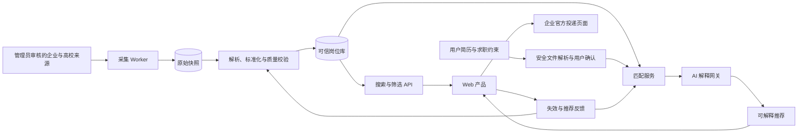

# 系统架构

## 1. 架构原则

- 围绕核心业务链路设计，不围绕现成开源项目设计。
- 我们自行维护来源注册表、适配器契约、岗位模型和匹配模型。
- 确定性处理优先，AI 只做需要语言理解的部分。
- 外部网页、用户文件和模型输出分别隔离。
- 每一步可重试、可观察、可回放、可人工纠正。
- MVP 保持少服务、少依赖，但保留清晰模块边界。

## 2. 系统上下文



## 3. 逻辑模块

### 3.1 Web 产品

- 岗位列表和详情。
- 简历/画像确认。
- 推荐结果和证据解释。
- 官方投递跳转。
- 用户反馈和数据删除入口。

### 3.2 应用 API

- 用户认证和对象级授权。
- 岗位查询和结构化筛选。
- 简历解析任务创建与状态查询。
- 推荐任务和结果读取。
- 管理端来源与审核接口。

### 3.3 来源管理

- 来源准入和域名白名单。
- 适配器配置、频率和解析器版本。
- 来源健康状态和暂停机制。

### 3.4 采集 Worker

- 只接受内部调度的 `source_id`，不接受任意 URL。
- 负责发现、列表抓取、详情抓取和原始快照。
- 运行在无用户数据、无模型密钥的低权限环境。

### 3.5 解析与质量

- 确定性字段提取。
- Pydantic Schema 校验。
- 企业和地点标准化。
- 去重候选、版本检测和有效性更新。
- 低置信度与异常记录进入人工审核。

### 3.6 简历解析

- 文件安全检查和隔离解析。
- 原文转纯文本。
- 结构化证据提取。
- 用户确认和修改。

### 3.7 匹配服务

- 硬性资格判断。
- 规则、词典和语义证据召回。
- 推荐信号计算。
- 生成交给 AI 的最小结构化上下文。

### 3.8 AI 网关

- 统一模型供应商接口。
- 脱敏和最小化输入。
- 固定系统提示和 JSON Schema。
- 超时、重试、成本限制和结果缓存。
- 输出校验和安全降级。

## 4. 数据存储

| 存储 | 内容 | 访问者 |
|---|---|---|
| PostgreSQL | 来源、企业、岗位、版本、用户画像、推荐、反馈 | 应用 API 和内部服务 |
| 原始对象存储 | 安全压缩的抓取快照和隔离简历原文件 | 专用处理服务 |
| 搜索索引 | 已发布岗位的可搜索字段 | 查询 API |
| 向量索引 | 岗位要求和用户证据向量 | 匹配服务 |
| 审计日志 | 来源变更、人工审核、数据删除和管理操作 | 管理员和安全审计 |

原始岗位快照与简历文件使用不同存储前缀、凭据和保留策略。

## 5. MVP 部署形态

MVP 不需要立刻拆成大量微服务，可以用三个独立进程保持边界：

```text
web-api
collector-worker
resume-match-worker
```

配套基础设施：

- PostgreSQL。
- 私有对象存储或开发期本地隔离目录。
- 数据库任务表或简单调度器。
- 可选的外部模型 API。

只有当来源数量、任务并发和重试需求明显增长时，再评估 Redis/Celery、专用搜索引擎或独立向量服务。MVP 不预装这些组件。

## 6. 技术候选而非最终决定

| 层 | 首选候选 | 原因 |
|---|---|---|
| 前端 | Next.js + TypeScript | 适合搜索、详情和用户工作台 |
| API | FastAPI + Pydantic | Python 数据和 AI 生态，强 Schema 契约 |
| 数据 | PostgreSQL + SQLAlchemy + Alembic | 事务、版本、关系和可迁移性 |
| HTTP | HTTPX | 超时、连接池、同步和异步支持 |
| 动态页面 | Playwright，仅必要来源启用 | 处理真正依赖浏览器渲染的官方页面 |
| 搜索 | MVP 先用结构化 SQL、`ILIKE`、`pg_trgm` | 避免过早增加搜索服务 |
| 语义召回 | 后续评估 `pgvector` 与中文模型 | 与关系数据共存、容易替换 |
| 调度 | 数据库任务表 + 单独 Worker | 简单、可观察、无需额外中间件 |

所有候选都需要经过 [依赖准入](04-security-threat-model.md) 后才能加入项目。

## 7. API 边界草案

### 用户侧

- `GET /jobs`
- `GET /jobs/{job_id}`
- `POST /resumes`
- `GET /resumes/{resume_id}/parse-result`
- `POST /resumes/{resume_id}/confirm`
- `POST /recommendations`
- `GET /recommendations/{id}`
- `POST /jobs/{job_id}/feedback`
- `DELETE /resumes/{resume_id}`

### 管理侧

- `POST /admin/sources`
- `PATCH /admin/sources/{source_id}`
- `POST /admin/sources/{source_id}/crawl`
- `GET /admin/crawl-runs`
- `GET /admin/review-queue`
- `POST /admin/review-queue/{id}/resolve`

采集 Worker 不暴露接受任意 URL 的公共 API。

## 8. 可观察性

每个任务使用 `trace_id` 贯穿调度、抓取、解析和入库，但日志不得包含简历正文。

必须记录：

- 来源和适配器版本。
- 各阶段数量和耗时。
- HTTP 状态分类和重试次数。
- 字段缺失和 Schema 拒绝原因。
- AI 调用模型、耗时、令牌量和 Schema 失败，不记录敏感正文。
- 用户删除和管理员修改审计。

## 9. 架构决策规则

新增组件前先回答：

1. 它解决了当前已出现的问题，还是想象中的规模问题？
2. 标准库或现有组件是否已经足够？
3. 它会接触哪些敏感数据和权限？
4. 失败时是否会影响全部来源或全部用户？
5. 能否通过内部接口替换？
6. 有什么测试证明它比当前方案更好？

无法回答时，不加入架构。
