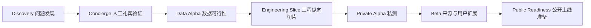

# 从 0 到 1 的产品工程流程

## 1. 目标

这套流程用于把产品假设逐步变成可运行、可验证、可维护的产品。它不是要求在编码前写完所有文档，而是让每一步只消除当前最危险的未知。

四条证据线必须同时存在：

```text
用户证据：问题是否真实、是否足够重要
数据证据：官方岗位能否稳定取得并保持可信
产品证据：推荐是否帮助用户采取行动
工程证据：系统能否安全、可重复、可回滚地运行
```

任何一条长期缺失，都不能靠增加功能或扩大岗位量补偿。

## 2. 阶段总览



阶段名称表达风险状态，不表达产品是否“高级”。没有通过退出门，就继续修正当前阶段或停止，不自动进入下一阶段。

## 3. Phase 0：Discovery 问题发现

### 要回答的问题

- 学生最近一次寻找实习或校招岗位时实际做了什么？
- 他们在哪些官方站点、公众号、高校网站和表格之间切换？
- 最浪费时间的是发现岗位、验证真假、判断资格，还是准备简历？
- 他们目前如何判断“值得投”，已经尝试过什么解决办法？
- 哪类用户的痛点最强，哪类只是口头表示感兴趣？

### 方法

- 8-12 次行为型访谈，覆盖在校生和应届生，但分别记录。
- 至少 5 次真实找岗任务观察，让用户共享最近的搜索过程或当场操作。
- 收集用户已有的表格、收藏夹、群聊、提醒和投递记录等行为证据。
- 不先展示完整解决方案，避免把礼貌性认可误认为需求。

### 产出

- 研究计划和知情说明。
- 脱敏访谈记录与研究快照。
- 用户分群、关键任务和痛点排序。
- [假设登记表](templates/assumption-register.csv)。
- 问题陈述和是否继续的决定。

### 退出门

- 至少一个清晰用户分群反复出现相同的高优先级问题。
- 用户能够提供近期真实行为，而不只是说“这个想法不错”。
- 至少 5 名目标用户愿意带真实岗位需求参与下一轮测试。
- 如果“信息分散”存在但不影响投递，必须调整价值主张，不能直接开发聚合站。

## 4. Phase 1：Concierge 人工礼宾验证

### 目的

在没有爬虫、账号系统和复杂界面前，验证“可信岗位 + 资格判断 + 证据解释”是否真的改变用户行动。

### 最小方案

- 人工整理 20-30 条官方岗位，保留来源、时间、地点和资格条件。
- 选择 5-8 名目标用户，让其提供去标识化简历文本和求职约束。
- 使用固定模板完成人工审核的匹配报告，不让 AI 直接决定结果。
- 记录用户选择、放弃原因、官方链接点击和自报投递。

### 建议实验

| 实验 | 对照 | 观察 |
|---|---|---|
| 岗位列表价值 | 只有官方岗位列表 | 用户能否更快找到符合约束的岗位 |
| 解释价值 | 列表 vs. 带证据推荐 | 解释是否改变用户的投递选择和准备动作 |
| 信任价值 | 只显示岗位 vs. 显示来源和验证时间 | 来源信息是否影响信任和点击 |
| 隐私接受度 | 不同的数据说明和保留方式 | 用户是否愿意提供去标识化简历文本 |

### 退出门

- 大多数测试用户能找到至少一个愿意认真考虑的岗位。
- 至少 3 名用户根据结果进入官方页面并自报完成投递或明确准备投递。
- 用户能够复述推荐理由，并指出哪些证据或缺口对决定有用。
- 记录至少一项被否定或被修改的产品假设。

## 5. Phase 2：Data Alpha 数据可行性

### 范围

只选 3 个经过审核的代表来源：

1. 公开 API、JSON 或结构化 ATS。
2. 含 JSON-LD 或稳定 HTML 的企业招聘页。
3. 一个需要有限动态渲染或具有不同发布逻辑的高校/企业页面。

### 实现

- 建立来源注册表和域名白名单。
- 自行实现 3 个小型适配器和固定测试夹具。
- 产生原始快照、来源记录、规范岗位和版本。
- 运行两周复查，记录字段准确率、失效率、结构变化和维护工时。

### 退出门

- 可见岗位来源可追溯率为 100%。
- 核心字段人工抽检准确率不低于 95%。
- 官方申请链接可访问率不低于 95%。
- 适配器失败会显式告警，不会返回空数据并误关全部岗位。
- 已经得到真实维护成本数据，证明继续增加来源是可承受的。

## 6. Phase 3：Engineering Slice 工程纵向切片

这一阶段不把岗位发现和简历匹配拆成两个半成品，而先实现一条薄而完整的用户链路：

```text
1 个官方来源
  -> 岗位入库
  -> 列表与详情
  -> 粘贴去标识化简历文本
  -> 用户确认证据
  -> 规则优先的资格与证据匹配
  -> 可解释推荐
  -> 官方投递链接
  -> 用户反馈
```

### 实现范围

- 查看岗位列表、详情、来源、最后验证时间和有效状态。
- 按城市、招聘类型、职能、毕业年份等少量核心条件筛选。
- 用户粘贴去标识化简历文本和求职约束；首轮不接收 PDF/DOCX。
- 提取 `ResumeEvidence` 和 `JobRequirement`，由用户确认简历证据，低置信度岗位要求进入抽检。
- 先运行确定性硬条件判断，再用规则、词典和必要的语义召回寻找证据对应。
- AI 只解释已有要求、证据、缺口和未知项；不可用时降级到规则和模板结果。
- 用户可以删除原始文本、结构化证据、向量和缓存。
- 初期运营使用受保护脚本、数据库视图和静态质量报告，不先开发完整管理后台。

### 退出门

- 固定测试集中，已知硬条件冲突漏检率为 0。
- 推荐解释引用真实 `requirement_id` 和 `evidence_id`，虚构用户经历数量为 0。
- 信息不足时输出未知，不强行给高分或推荐。
- 来源失败、AI 失败和删除请求都有可测试的失败或降级路径。
- 关键链路有自动测试、日志和版本标识，可在测试环境重复运行和回滚。
- 5-10 名目标用户无需讲解即可完成“找岗 -> 看依据 -> 前往官方页”的任务。

通过第一条链路后，再把 Phase 2 的另两个来源接入同一管线。文件上传必须在隔离解析、安全测试和删除演练通过后单独开放。

## 7. Phase 4：Private Alpha 私测

### 样本

- 20 名目标用户。
- 至少 10 人确认简历证据和求职约束。
- 至少 5 人根据推荐进入官方页面并自报投递。

### 关注指标

- 画像确认完成率。
- 推荐理由有帮助的比例。
- 官方投递链接点击率。
- 用户自报投递率及其原因。
- 一周内再次使用率。
- 错误类型：失效、硬条件、证据、排序、交互和隐私顾虑。

退出门不是“用户都喜欢”，而是已经知道哪些用户、哪些岗位、哪些推荐机制稳定创造价值，主要失败模式可以复现并有修正优先级，且至少出现真实复用行为。

## 8. Phase 5：Beta 来源与用户扩展

只有私测证明核心链路成立后，才逐批扩展：

- 将来源从 3 个增加到约 10-20 个，并记录每一批的准确率和维护工时。
- 将经过抽检的有效岗位扩大到约 100-300 条，而不是追求未经验证的岗位总量。
- 根据真实查询和零结果数据扩展职能、城市和招聘类型。
- 确有高频运营需求后，再建设来源健康、人工审核和异常处理界面。
- PDF/DOCX 仅在隔离解析、恶意文件测试和删除验证通过后灰度开放。

扩展不能显著拉低字段准确率、链接有效率或响应时效；新增供给必须改善目标用户的有效推荐，而不只是增加列表长度。

## 9. Phase 6：Public Readiness 公开上线准备

公开发布前必须同时通过：

- [合规与公开上线门](11-compliance-and-public-launch.md)。
- [安全威胁模型](04-security-threat-model.md)中的上线前安全门。
- 数据备份、恢复、删除和来源停用演练。
- 监控、告警、值守边界和故障处理流程。
- 隐私政策、服务规则、来源说明、反馈和申诉入口。
- 灰度发布、回滚和已知问题清单。

没有通过时可以继续做受控原型和私测，但不能把它描述为已经具备公开运营条件。

## 10. 工程实现顺序

采用薄的纵向切片，每次让一条真实用户链路端到端可运行：

1. 一份人工岗位数据可以在页面中被查看和筛选。
2. 一个来源可以被采集、保存快照、解析并显示。
3. 三个来源可以独立失败和复查。
4. 用户可以粘贴文本、确认一条简历证据并删除。
5. 一个岗位可以完成硬条件判断和证据对应。
6. AI 可以基于固定 ID 生成解释并通过 Schema 校验。
7. 用户可以完成“发现 -> 判断 -> 官方链接 -> 自报反馈”。

每一步都先运行、测试和观察，再扩展同类功能。

## 11. 需求与变更管理

### 11.1 工作项最小结构

每个功能或缺陷至少记录：

- 稳定 ID，例如 `REQ-JOB-001`、`RISK-SEC-003`。
- 用户和要解决的问题。
- 范围内与范围外。
- 可验证的验收条件。
- 涉及的数据、安全、隐私和可观察性。
- 对应的测试和发布方式。

### 11.2 Ready 条件

一个工作项进入开发前应满足：

- 用户价值和使用场景明确。
- 依赖、风险和未知项已标记。
- 验收条件可以由测试或观察证明。
- 变更足够小，能够独立回滚。
- 不需要先完成一整套未来架构。

### 11.3 Done 条件

完成不等于代码生成。至少需要：

- 验收条件通过。
- 相关自动化测试和必要的手动 QA 通过。
- 日志、指标和错误状态能够定位问题。
- 安全与隐私影响经过检查。
- 文档、数据字典或决策记录按需更新。
- 在目标环境运行并保留验证证据。

## 12. 架构决策记录

只有满足以下任一条件时才创建 ADR，避免文档膨胀：

- 影响多个模块或长期数据格式。
- 引入新的外部服务、敏感权限或难以替换的依赖。
- 存在两个以上有真实取舍的方案。
- 以后很可能追问“为什么这样做”。

使用 [ADR 模板](templates/adr.md)，记录背景、决定、替代方案、后果和复查条件。决定变化时新增记录，不改写历史。

## 13. 测试策略

具体数据抽检、简历解析、匹配金标集、在线指标和发布门见 [验证与质量策略](12-validation-and-quality-strategy.md)。

| 层级 | 本项目重点 |
|---|---|
| 单元测试 | URL 校验、字段规范化、岗位状态、硬条件规则、删除范围 |
| 适配器契约测试 | 使用本地夹具验证发现、解析、页面变化和失败信号，不访问真实站点 |
| 集成测试 | 调度、快照、解析、数据库、版本和去重流水线 |
| E2E 测试 | 筛选岗位、查看来源、确认证据、查看推荐、跳转官方链接 |
| 安全测试 | SSRF、重定向、对象越权、XSS、提示注入、恶意文件（开放上传后） |
| AI 回归评估 | 固定金标、用户切片、引用正确性、幻觉、未知项、成本和延迟 |
| 恢复测试 | 来源失败不扩散、任务幂等、备份恢复、删除和回滚 |

不追求一个脱离风险的统一覆盖率数字。高风险确定性逻辑和数据删除需要更强覆盖，展示性代码可以按实际价值决定。

## 14. 代码与发布流程

- 每个提交和 PR 只处理一个可解释的变化。
- 提交说明写清“改了什么、为什么改、如何验证”。
- 默认分支受保护；变更通过 PR、测试和审查进入。
- 第三方 Action 固定到提交 SHA，CI 令牌默认只读。
- 环境至少区分本地、测试/预发布和生产，敏感数据不得复制到开发环境。
- 新功能先对内部或小样本用户开放，再逐步扩大。
- 每次发布有回滚条件、数据库迁移策略和已知风险。

## 15. 可观察性与运营闭环

必须能回答：

- 哪个来源从什么时候开始失败？
- 哪个解析器版本导致字段异常？
- 哪条推荐因哪个规则或模型版本生成？
- 用户在哪一步放弃？
- 删除请求是否覆盖全部数据副本？
- 一次发布是否让数据质量、推荐质量或成本变差？

上线后的反馈应进入以下闭环：

```text
事件、投诉、错误和用户反馈
  -> 分类与严重级别
  -> 复现和根因
  -> 修复与回归测试
  -> 发布和观察
  -> 更新风险、假设或产品边界
```

## 16. 最小治理文件集

为了防止再次陷入文档过度建设，每个阶段只维护真正影响决策的文件：

1. 产品定义与当前 PRD。
2. 假设登记表与实验记录。
3. 来源/岗位数据字典和质量报告。
4. 风险登记表与必要的 ADR。
5. 需求到测试追踪表。
6. 发布验证和用户反馈记录。

如果一份文档既不影响决定，也不帮助验证或交接，就不创建。
