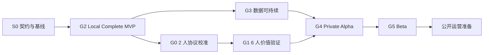

# 从 0 到 1 的稳定产品工程流程

> 本文定义项目长期使用的阶段顺序、证据类型和变更规则，不记录当前进度。动态状态只在 [MVP 路线与当前决策面板](06-mvp-roadmap.md) 更新。

## 1. 四条证据线

| 证据线 | 要回答的问题 |
|---|---|
| 用户证据 | 问题是否真实、频繁且会影响行动 |
| 产品证据 | 完整方案是否改善高质量投递决定 |
| 数据证据 | 官方岗位能否合规、准确、持续维护 |
| 工程证据 | 产品能否安全、可重复、可删除、可恢复地运行 |

2026-07-18，coco 明确接受：先承担受限工程成本，完成可真实操作的本地 MVP，再做参与者验证。因此工程证据可以先于用户/产品证据建立，但不能冒充后两者。产品证据在参与者验证前保持 `E0`。

## 2. 固定顺序

Gate ID 是稳定引用，不表示数字顺序。G3 可以与 G2 并行，但 Private Alpha 必须等待 G0、G1、G2、G3 全部通过。

## 3. 各阶段职责

| 阶段 | 核心问题 | 必要产物 | 退出原则 |
|---|---|---|---|
| S0 契约与基线 | 当前 MVP 到底包含什么，旧决定如何被新 ADR 接替 | PRD v0.2、ADR、路线、交接、一致性检查 | 没有仍被标作当前契约的冲突 |
| G2 Local Complete MVP | 一台电脑上能否完成真实闭环 | 三来源目录、简历、三轴、推荐、AI 优化、DOCX、决定、删除和端到端测试 | PRD v0.2 全部验收通过 |
| G0 2 人协议校准 | 使用完整 MVP 的任务、术语和记录是否可执行 | 两份完整校准记录、修订后的协议 | 无需研究者额外教学；受影响部分已重测 |
| G1 6 人价值验证 | 完整方案是否改变高质量投递决定 | 六份正式任务、72 小时回访、反例和守护事件 | 量化阈值通过且硬守护事件为 0 |
| G3 数据可持续 | 三个来源能否合规、连续、独立失败 | 来源准入、快照夹具、新鲜度、质量与维护成本 | 三个来源稳定、可追溯、可暂停 |
| G4 Private Alpha | 产品在真实求职周期中是否复用且可运营 | 匿名邀请、连续行为、故障和恢复记录 | 核心结果持续出现，主要失败可控 |
| G5 Beta | 扩大来源与用户是否仍保持质量 | 分批扩展、成本和质量趋势、发布/回滚证据 | 新增供给改善有效决定且守护指标不恶化 |
| 公开运营准备 | 是否具备面向非受邀用户运行的责任能力 | 合规复核、隐私说明、事件响应、申诉和下线流程 | 公开条件独立检查通过 |

## 4. 共同工作循环

1. 从当前 Gate 选择一个可独立验收的纵向切片。
2. 写清用户任务、范围、失败路径、数据/权限/删除影响和测试。
3. 从 PostgreSQL、API/Worker 到 Web 形成一条可运行链路。
4. 用离线夹具、自动测试、浏览器任务和安全检查共同验收。
5. 记录反例、未证明事项和回退方式。
6. 更新路线面板；长期边界变化新增 ADR。
7. 只有完成 Gate 全部条件，才改变阶段状态。

## 5. Gate 规则

### 5.1 结果 Gate

- 用户能完成定义清楚的高质量投递决定。
- 结果可追溯到来源、岗位条件和用户确认的事实或经历证据。
- 官方投递自报是下游强证据，不能用链接点击冒充。

### 5.2 硬守护 Gate

以下事件不能被平均指标抵消：

- 明确硬条件冲突漏检。
- 基于错误或未知信息劝退用户。
- 虚构经历、成果或岗位条件。
- 未确认事实参与确定性结论。
- 跨 owner 越权、数据无法删除或隐私事件。
- 来源越过登录、验证码、访问控制或明确禁止边界。

### 5.3 AI Gate

- 本地完整 MVP 必须实现受控 AI 简历优化，同时保留模板降级。
- AI 只能生成引用真实 `requirement_id` 和 `evidence_id` 的修改候选，不能改写资格、用户事实或岗位决定。
- 每次发送 owner 数据都需要用户显式选择。
- 公开启用必须证明理解正确率或决策效率增量，且不引入新的事实错误；效果相同或不稳定时保留模板。

### 5.4 扩展 Gate

只有新增来源、岗位方向或用户人群能够改善有效决定，且不降低数据质量、安全、隐私或维护边界时，才继续扩展。

## 6. G2 纵向切片规则

实现顺序固定为：

1. S0：契约收敛和历史研究筛选收尾。
2. S1：20–30 家企业、300–500 条全部职能实习岗位、中小企业占比和正式目录。
3. S2：匿名 owner、PDF/DOCX/文本、确认和删除。
4. S3：三轴 `MatchRun`、确定性 `RecommendationRun` 和五态决定。
5. S4：受控 `ResumeTailoringRun`、逐段确认和 DOCX。
6. S5：运行权限、端到端、安全、移动端和无障碍验收。

每个切片必须纵向完成；单个切片、单个来源或单个页面不能称为完整 MVP。不要先横向建设完整数据库、完整后端、完整前端或 AI 平台后才集成。

## 7. Ready 与 Done

### Ready

- 有明确用户任务和所属 S0–S5 切片。
- 范围内、范围外和可验证验收条件明确。
- 数据、来源、安全、隐私、失败和删除影响明确。
- 有足够小的变更边界、离线夹具和回退方式。

### Done

- 验收条件和相关自动测试通过。
- 错误、空状态和降级路径可操作。
- 日志与指标不泄露用户正文。
- 权限、隐私、删除、恢复和迟到任务检查通过。
- 目标环境可重复运行并留下验证证据。
- 路线面板和必要契约已更新。

## 8. 文档归属

| 信息 | 唯一归属 |
|---|---|
| 产品定位、首轮用户、价值边界 | [产品定义](00-product-definition.md) |
| 当前完整 MVP 功能与验收 | [PRD v0.2](01-prd-v0.2.md) |
| 当前阶段、进度、最高风险和下一决定 | [路线面板](06-mvp-roadmap.md) |
| 2 人/6 人研究与 AI 对照方法 | [产品发现与实验](09-product-discovery.md) |
| 系统、接口、任务和权限 | [系统架构](05-system-architecture.md) |
| 稳定流程与交付治理 | 本文与 [工程交付规范](10-engineering-delivery.md) |

信息冲突时，先按上表确认归属，再修改引用方。历史 PRD、ADR 和证据记录保留原状并明确标记被取代，不静默重写历史结论。

## 9. 回退与停止

出现以下情况时回到最早缺失证据的阶段：

- G2 无法在已锁定边界内形成完整闭环。
- 用户验证没有发现会影响投递的重复性问题。
- 完整方案不改变判断或行动。
- 用户无法正确理解资格、证据、未知和偏好。
- 官方来源维护成本超过可见用户价值。
- 产品出现硬守护事件。
- 扩展只能依赖越权访问、不可追溯自动结论或过度收集数据。

已经完成的代码量不能成为降低 Gate 或继续扩张的理由。
