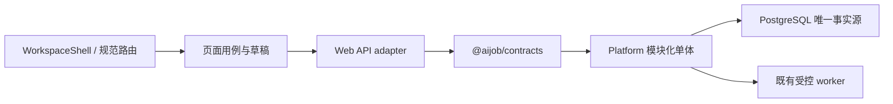

# Career OS 端到端体验与系统契约

> 状态：Active / UX-0 基线已接受，OS-1 与 OS-2 触达范围已关闭
>
> 生效日期：2026-08-13
>
> 当前验收状态：UX-0 代码反证、Review migration 兼容断言与四视口基线已完成；OS-1 系统外壳/运行契约和 OS-2 资料/可信岗位入口也已通过各自五项 Gate。下一候选切片为 OS-3，尚未实施；见 [OS-2 证据](evidence/product/career-os-v2/os-2-profile-and-trusted-job-entry-acceptance-2026-08-13.md)。
>
> 动态任务只看 [MVP 路线](06-mvp-roadmap.md)、[当前交接](handoffs/current.md)和[当前交付计划](plans/career-os-current-delivery-plan.md)。本文固定设计规则，不生成新的任务顺序。

## 1. 目的与适用边界

本文把 coco 提供的三张 Career OS 概念图、现有 Web、Contracts、Platform、PostgreSQL 能力和“UX-0 审计 → OS-1–OS-7 同步实现”路线，收敛为可实现、可测试、不会随页面开发漂移的端到端契约。

它约束整个 V2 用户旅程：

- 今日、岗位目录、岗位详情、我的求职、Case 六个工作区。
- 简历资产、简历导入与确认、岗位简历工作室。
- 投递、面试、复盘、数据与设置、访问、错误和删除状态。
- 统一 Shell、检查器、抽屉、对话框、焦点、响应式和性能边界。
- 每个用户动作对应的请求/响应 schema、领域所有权、PostgreSQL 事实、owner/并发/删除语义和端到端证据。

本文不预先宣称现有 API、Contracts 或数据库已经匹配目标交互。后续切片可以在现有模块化单体内做经 UX-0 证明的最小适配或扩展，但不得新增第二套服务、第二套事实源、第二套认证或越过来源准入、AI 与 Private Alpha Gate。内部 `/research/*` 与 `/internal-preview/*` 不进入本轮用户旅程收敛。

## 2. 端到端系统架构

### 2.1 固定调用链



- Web 只组织呈现、URL、局部草稿和显式用户确认，不在浏览器中拼接跨领域事实或发明后端没有的结论。
- `@aijob/contracts` 是请求、响应、状态枚举和 Problem 的共同边界。本轮改动过的核心响应必须在 Web 边界做运行时 schema 校验，不能只依赖 `apiRequest<T>` 的静态类型断言。
- Platform 继续保持模块化单体。跨 `applications / catalog / profile / matching / insights / resume / resume-documents / tailoring / interviews / identity` 的组合由现有 Platform 应用层显式编排，不新建 BFF。
- PostgreSQL 继续是唯一查询和任务真源。页面刷新后需要恢复的关联不能只存在 React state、URL 中的临时 run ID 或浏览器缓存。
- mutation 必须继续满足 owner、CSRF、幂等、revision、session 不重放和删除语义；视觉简化不能绕过这些边界。

### 2.2 复用不是默认结论

每个用户用例在实施前必须标记一种处置：

| 标记 | 含义 | 允许条件 |
|---|---|---|
| `R — 直接复用` | 现有契约和事实语义完整匹配 | 可从规范路由真实恢复；无需前端猜测或 N+1 |
| `A — 适配` | 领域能力存在，只缺规范 read model / command adapter / runtime parse | 不改变事实含义，不建立第二套真源 |
| `E — 扩展` | 现有契约缺少目标交互必要字段、查询或持久关联 | 先补 Contracts、Platform 集成测试和回退 |
| `M — 最小迁移` | 现有表无法持久表达必要语义 | 当前切片明确证明、评审、迁移测试和回退后才允许 |
| `X — 排除` | 不属于当前用户结果或违反固定边界 | 必须写明替代入口，不能以兼容说明冒充融合 |

任何核心行仍是“待决定”时，UX-0 不通过。不得先画页面，再用临时静态数据、成功响应 mock 或客户端 join 填空。

### 2.3 当前端到端差距矩阵

| 用户能力 | 当前系统事实 | 当前判定 | 负责切片 |
|---|---|---|---|
| session / owner / CSRF / 不重放 | OS-1 已统一 Shell/session boundary；OS-2 已关闭首次页面并发 session 创建多个 owner 的风险，mutation 仍不重放 | `R/A` 触达范围已关闭 | OS-1、OS-2；OS-7 总验 |
| 岗位检索、facet、详情 | OS-2 已接入规范工作台、筛选 URL、刷新/深链/历史恢复、unknown 与失败重试 | `R/A/E` 触达范围已关闭 | OS-2 已关闭 |
| Case 创建、固定版本、删除 | 主体存在；transition、diff/upgrade 未进入完整 V2 交互 | `R/A` | OS-3、OS-4 |
| 看板列表、筛选、计数 | API 只有 stage/cursor/limit；Web 对已加载子集做 city/sort | `E`：Case list + board read model，无语义 migration | OS-3 |
| Requirements / Evidence / Questions | 三证据状态、revision、owner 语义存在 | `R/A` | OS-4 |
| 三轴匹配 | immutable run 存在；但创建/Worker 只接受当前目录版本，不能直接处理 Case 固定旧版本 | `E`：Case-scoped adapter + `case_pinned` 任务上下文；按固定版本、requirement set 与资料修订查回，不加 Case 外键 | OS-4 |
| 推荐 | OS-2 已在现有 RecommendationRun 下实现服务器按搜索创建与固定岗位投影 view，事务内冻结候选/要求/新鲜度/资料 | `E` 已关闭：规范入口归入 `/jobs/recommended*`，无第二种 Run 或 migration | OS-2 已关闭 |
| JD 市场洞察 | scope 聚合继续与单 Case Requirements 分离；规范表单与持久 Run 深链已接入 | `A` 已关闭：归入 `/jobs/insights*`，明确排除 Case JD 面板 | OS-2 已关闭 |
| 简历导入/确认 | 后端主体已由规范 `/resumes/import*` 承接，资料当前态与一次性确认响应使用共享 runtime schema | `R/A` 已关闭 | OS-2 已关闭 |
| Resume V2 / Review / DOCX | 主体存在；当前模板 Review 未读取固定 Requirements，Finding/Suggestion 无 requirement 引用 | `E + M`：固定岗位要求进入 template/AI 生成链并持久引用；同时收敛草稿、错误与响应式 | OS-5 |
| 旧 Tailoring / 受控 AI | Tailoring 有低层 provider/去标识化能力；Review 预留 mode 但请求/Worker 只实现 template，Run 缺 provenance/failure | `E + M`：新写入统一归 Resume Review，v1/v2 兼容的最小 expand migration；旧 Tailoring 只读 | OS-5 |
| 投递 / 面试 / 复盘 / 删除 | 后端主体与现有 V2 主路径存在 | `R/A` | OS-6 |
| 完整浏览器夹具 | OS-1/OS-2 已有真实 API、隔离 PostgreSQL 与四视口 runner；后续仍需逐切片扩展并由 OS-7 总验 | `E`（测试基础设施）触达范围已关闭 | UX-0、OS-1、OS-2；OS-7 总验 |

详细代码证据和当前判定见 [UX-0 端到端审计](evidence/product/career-os-v2/ux-0-end-to-end-contract-and-baseline-2026-08-13.md)，字段级请求、响应、Problem 与断言见 [UX-0 页面—系统—证据追踪矩阵](plans/career-os-ux-0-end-to-end-traceability-matrix.md)。

## 3. 设计方向

### 3.1 一句话定义

Career OS 是一个**高密度、克制、可信的专业求职驾驶舱**：像用户每天处理真实任务的桌面工具，不像营销落地页、聊天机器人或独立简历生成器。

用户应该首先记住三件事：

1. 所有工作围绕同一个岗位 Case 继续，不在页面之间重新开始。
2. 岗位原文、用户证据和系统建议始终能看出区别。
3. 右侧检查器帮助用户处理当前对象，不替用户做决定。

### 3.2 必须呈现的气质

- 结构清楚、信息密度高，但不使用低于 12px 的微型文字换取密度。
- 纸面、表格、列表、分栏与工作台感优先；装饰退后。
- 颜色用于状态和动作，不用于制造“AI 感”。
- 页面标题、工具栏、正文、元数据和状态形成稳定层级，不出现超大 Hero 与微型正文的跳变。
- 动效只解释状态变化、面板开合和焦点迁移；默认 120–180ms，并遵守 `prefers-reduced-motion`。

### 3.3 明确拒绝

- 紫色渐变、玻璃拟态、发光边缘、装饰性大渐变和悬浮 AI 助手。
- 营销式大 Hero、夸张留白和脱离任务的欢迎页。
- “匹配良好 / 中 / 差”、匹配百分比、总分、自动劝退或隐藏岗位。
- 为填满界面伪造公司、岗位、截止日期、任务、用户身份、证据或建议。
- 独立“AI 简历工作台”品牌或第二套 Shell。
- 依靠 `overflow-x: hidden` 隐藏布局失败。

## 4. 概念图事实与采用边界

三张图片只约束布局、密度、信息层级和交互关系。图片中的业务内容不进入产品数据、测试事实或产品证据。

### 4.1 文件身份

| 实际文件 | 尺寸 | 实际画面 | SHA-256 | 备注 |
|---|---:|---|---|---|
| `exec-fbfc5aa0-40b1-4a16-a8e9-5601e46282b2.png` | 1536×1024 | 中文岗位简历工作室 | `D794D4C9F29BD215F159623EEC2C0B0BFDFCB8EFE1E80DAC5A3259B1600EC298` | 交接标签曾写成“申请看板”，以实际画面为准 |
| `exec-da0cb770-a2bb-4a35-840d-1865238c4ded.png` | 1599×984 | 单岗位 JD 能力工作区 | `C9B0A68F38AC718BC283A1285354BC553F0036C8531F672D504B21C42F51557F` | 标签与画面一致 |
| `exec-73a133e8-cdc2-40d7-a937-bc6352e87a76.png` | 1536×1024 | 我的求职看板与右侧 Peek | `915047A90A5D63A9E9FDAD2D5793536561F76DB9BA31CC12306497729B85AA88` | 交接标签曾写成“中文简历工作室”，以实际画面为准 |

图片不复制进仓库；以上尺寸和摘要只用于防止引用错图。

### 4.2 看板与 Peek

采用：

- 左侧全局导航、顶部工具栏、五阶段看板和右侧岗位 Peek 的同屏关系。
- 紧凑卡片、阶段计数、列表/看板切换、筛选、排序和明确的“打开工作区”。
- Peek 只在选中 Case 后按需读取，显示当前阶段、固定岗位信息、来源与下一动作。
- 桌面 Peek 为可调整宽度的补充区域；窄屏转为覆盖式抽屉或全屏面板。

拒绝或替换：

- 图中的“匹配良好 / 中 / 有差距”全部拒绝。
- 公司、岗位、日期、数量和“下一步”文案不作为业务夹具。
- 拖拽不直接写阶段；阶段变化继续由显式用户动作确认。

### 4.3 JD 能力工作区

采用：

- 统一 `CaseHeader`、六个 Case 标签、五阶段进度和固定岗位版本说明。
- 要求按硬条件、职责能力、未知待确认分组。
- 每项要求保留官方原句、来源和证据状态；当前项在右侧检查器处理。
- 桌面主表与检查器同屏；移动端要求列表与检查器分步呈现。

拒绝或替换：

- “已验证”统一替换为`已有证据`。
- “证据不足”只有用户已经确认缺口时才映射为`证据待补充`；否则使用`用户尚未确认`。
- “下一步建议”只能来自确定性业务状态或用户确认的事实，不得包装成模型判断。

### 4.4 简历工作室

采用：

- 左侧结构、证据和版本，中间 A4 文稿，右侧要求、证据和审阅建议。
- 基础简历与岗位简历复用同一编辑框架，但明确标出不同事实上下文。
- 文稿可打印、可导出 DOCX；建议只允许接受、编辑后采用或拒绝。
- 移动端使用“结构 / 文稿 / 建议”模式切换，不压缩三栏。

拒绝或替换：

- 独立“AI 简历工作台”品牌。
- 未确认的电话、邮箱、学校、经历、数字或项目成果。
- 建议自动写入文稿或把模板输出冒充用户事实。

## 5. 信息架构与旧能力处置

### 5.1 唯一 Shell

`VITE_CAREER_OS_V2=true` 时，所有用户路由必须运行在 `WorkspaceShell` 中；未知路由、访问错误和懒加载错误也不得退回 `ProductShell`。`VITE_CAREER_OS_V2=false` 时旧 `ProductShell` 和旧 URL 保持完整回退能力。

### 5.2 路由处置矩阵

| 路由或能力 | V2 最终处置 | 主要 URL 状态 | 负责切片 |
|---|---|---|---|
| `/` | 重定向 `/today` | 无 | OS-1 |
| `/today` | 保留并统一为任务概览 | 可恢复的局部筛选若后续出现 | OS-6 |
| `/jobs` | 保留 URL，旧岗位目录自然嵌入 WorkspaceShell | 查询、城市、职能、排序、页游标 | OS-2 |
| `/jobs/:jobId` | 保留 URL，岗位事实、三轴核对入口与加入 Case 动作统一 | `jobId`、来源上下文、可选当前 match run | OS-2、OS-4 |
| `/jobs/recommended` | 推荐准备页；由 Platform 从规范岗位筛选冻结候选集 | 筛选、资料准备状态 | OS-2 |
| `/jobs/recommended/:runId` | 持久化 RecommendationRun 与岗位投影 | `runId` | OS-2 |
| `/jobs/insights` | 市场 JD 洞察条件页；不与单 Case Requirements 混用 | family、city、scale、是否对照证据 | OS-2 |
| `/jobs/insights/:runId` | 持久化市场洞察报告 | `runId` | OS-2 |
| `/applications` | 主申请看板/列表 | `view`、`stage`、`city`、`sort`、`peek` | OS-3 |
| `/applications/:caseId` | 兼容重定向 `overview` | `caseId` | OS-4 |
| `/applications/:caseId/:tab` | Case 六标签唯一工作区 | `tab`；各页只增加必要选中项 | OS-4、OS-5、OS-6 |
| `/resumes` | 简历资产首页 | 来源提示、当前选择 | OS-5 |
| `/resumes/:documentId` | 基础或派生简历工作室 | `documentId`、`block`、工作模式 | OS-5 |
| `/resumes/import` | **规范前台路由已接入**，承接现有 `/resume` 能力 | 输入模式，不把原文放 URL | OS-2 已关闭 |
| `/resumes/import/confirm/:analysisId` | **规范确认路由已接入**，承接现有确认能力 | `analysisId`、确认步骤 | OS-2 已关闭 |
| `/resume`、`/resume/confirm/:analysisId` | 兼容入口，重定向或委托规范路由；旗标关闭时保持旧行为 | 保留旧参数 | OS-2 |
| `/recommendations` | V2 兼容重定向 `/jobs/recommended`；V2=false 保留旧页 | 无 | OS-2、OS-6 |
| `/insights` | V2 兼容重定向 `/jobs/insights`；V2=false 保留旧页 | 无 | OS-2、OS-6 |
| `/resume-tailorings/:runId` | 历史只读；新模板/受控 AI 写入统一归 Resume V2 Review | `runId` | OS-5、OS-6 |
| `/settings/data` | 数据与设置唯一入口 | 必要的结果提示 | OS-6 |
| `/settings/data/deletion` | 全量删除状态与回执 | 无敏感内容 | OS-6 |
| `/data-control*` | 兼容重定向 `/settings/data*` | 保留旧入口可达 | OS-6 |
| 未知用户路由 | WorkspaceShell 内统一 404 | 原路径可见 | OS-1 |
| `/research/*`、`/internal-preview/*` | 排除用户前台，不共享本轮视觉完成声明 | 不适用 | 不在本计划 |

### 5.3 懒加载契约

- `WorkspaceShell` 可独立加载，但进入 V2 后 Shell 不能因单个页面 chunk 失败而整页消失。
- 岗位目录、规范导入/确认和历史 Tailoring 在 V2 中按路由 lazy load，不能重新并入主包。
- 看板与 Case 概览首屏不得加载 Resume Editor、Interview 或数据设置。
- 每个路由 chunk 失败时在 Shell 内显示可重试错误，不落入空白页。

### 5.4 规范能力与领域所有权

| 规范用户能力 | 唯一领域所有者 | 禁止做法 |
|---|---|---|
| 岗位事实、公开状态、来源和筛选 | `catalog` / jobs API | Case 或 Web 复制一份可漂移岗位事实 |
| Case 生命周期、固定岗位版本、Requirements、问题和投递事件 | `applications` | React 直接推断业务阶段或把 URL 当事实源 |
| 用户事实、偏好和已确认经历证据 | `profile` | 把资格、证据和偏好合成总分 |
| 三轴核对与推荐 run | `matching` | 只把 run ID 放在组件 state/临时缓存中，或不经 Case/owner 恢复 adapter 就宣称已融入 |
| 跨岗位 JD 市场洞察 | `insights` | 把聚合市场结论冒充单岗位官方要求 |
| 原简历解析与确认 | `resume` / `profile` | 将原文长期复制到新前台状态或测试夹具 |
| 可持续简历资产、修订、Review、DOCX | `resume-documents` | 与旧 Tailoring 保持两套继续可写的事实 |
| 历史逐段 Tailoring | `tailoring`（历史能力） | 从 V2 重新开启新建、决策或导出写入，与 Resume Review 形成双写 |
| 面试、反馈、复盘确认 | `interviews` | 页面本地生成反馈或绕过确认直接回流 |
| session、owner、账号认领 | `identity` | 页面保存第二套 owner/session 状态 |

跨领域页面可以组合这些能力，但组合查询、持久关联和权限检查必须由明确的 API adapter / Platform read model 承担，不能散落为浏览器 N+1 请求。

## 6. 页面状态契约

### 6.1 每个核心页面必须支持

| 状态 | 视觉和行为契约 |
|---|---|
| Loading | 保留 Shell 与主要布局，不用整页纯文本替换；说明正在读取什么 |
| 真实空态 | 只由真实空响应产生；解释用户现在能做什么，不注入演示数据 |
| 筛选空态 | 保留当前筛选，显示清除筛选动作，与真实空态分开 |
| 满态 | 只显示 API 已有字段；未知字段显示“未说明”或合法未知状态 |
| 可恢复 API 失败 | 说明失败对象并提供显式重试；重试不能重复 mutation |
| 404 / 跨 owner | 统一不可枚举文案；不得泄漏存在性、owner 或历史内容 |
| 409 revision | 保留本地草稿，读取最新 revision，要求用户核对后再次确认 |
| session 恢复 | 读请求最多自动恢复一次；mutation 永不自动重放，明确提示再次提交 |
| 删除后不可读 | 原 URL 进入统一 404；保留资产只在其合法新入口可读 |
| 刷新和深链 | 恢复同一路由和已承诺的 URL 状态，不依赖内存对象 |
| 前进 / 后退 | 恢复页面选择；有未保存草稿时先保护草稿，不静默丢失 |

### 6.2 当前已知差距的归属

| 已知差距 | 不得在 UX-0 顺手修复 | 负责切片 |
|---|---|---|
| V2 404 回到 ProductShell、没有路由级 Error Boundary | 是 | OS-1 已关闭 |
| Overlay 缺少统一焦点约束、Esc、背景 inert 和可靠返焦 | 是 | OS-1 已关闭 |
| Case list 只支持 stage/cursor，Web 对已加载子集做 city/sort；Peek 404 静默关闭、五列与 Peek 尺寸冲突 | 是 | OS-3 |
| transition、job-version diff/upgrade 已在 Platform 但未完整接入 Web；Requirement 桌面检查器不能真实收起 | 是 | OS-3、OS-4 |
| 三轴 matching run 没有 V2 Case 可恢复入口，现有 Worker 又拒绝 Case 固定旧版本 | 是 | 已选 Case-scoped adapter + `case_pinned` 任务上下文；OS-4 实施 |
| Resume Studio 草稿可能丢失；Review 未读取固定 Requirements、无 requirement 引用，controlled_ai 与 provenance 也未实现 | 是 | 已选 Review 唯一新写入 + v1/v2 最小 expand migration；OS-5 实施 |
| recommendation / insights 在 V2 仅兼容说明；`/resumes/import*` 缺失、岗位筛选不进 URL | 是 | OS-2 已关闭：规范 `/jobs*` 与 `/resumes/import*` 已接入 |
| 今日、岗位详情、设置、旧只读页的错误语义不一致 | 是 | 岗位详情触达范围由 OS-2 关闭；其余归 OS-6 |
| 通用 `apiRequest<T>` 对多数业务响应不做运行时 schema 解析 | 是 | 随 OS-1–OS-6 触达端点修正；OS-7 总验 |
| 刷新部署、全路由键盘、性能和回退总验证 | 是 | OS-7 |

## 7. 视觉 token

OS-1 开始必须把 token 从页面字面量中抽离。旧 `ProductShell` 可以保留自己的回退 token，但不得继续污染 `.career-os`。

### 7.1 字体与排版

不新增外部字体、CDN 或远程依赖。中文系统字体是受约束环境中的确定选择，品牌辨识通过版式而不是下载字体实现。

```css
--co-font-ui: ui-sans-serif, "PingFang SC", "Microsoft YaHei",
  "Noto Sans CJK SC", sans-serif;
--co-font-document: ui-serif, "Songti SC", STSong, SimSun, serif;
--co-font-mono: ui-monospace, "SFMono-Regular", Consolas, monospace;

--co-text-xs: 0.75rem;       /* 12px，UI 禁止更小 */
--co-text-sm: 0.8125rem;     /* 13px */
--co-text-md: 0.875rem;      /* 14px，默认正文 */
--co-text-lg: 1rem;          /* 16px */
--co-title-sm: 1.25rem;      /* 20px */
--co-title-md: 1.5rem;       /* 24px */
--co-title-lg: 2rem;         /* 32px */

--co-leading-tight: 1.3;
--co-leading-normal: 1.55;
--co-leading-document: 1.75;
--co-weight-regular: 400;
--co-weight-medium: 500;
--co-weight-semibold: 600;
--co-weight-bold: 700;
```

要求：

- 页面标题最大 32px；A4 文稿中的姓名可例外，但不能影响工作台层级。
- 工作台默认正文 14px，紧凑元数据 12–13px。
- 不使用 650、760、830 等依赖浏览器合成的非标准字重。
- 宋体只用于岗位标题、少量页面标题或文档正文，不用于所有控制器。

### 7.2 色彩

```css
--co-canvas: #f7f8fa;
--co-surface: #ffffff;
--co-surface-subtle: #fbfcfd;
--co-text: #172033;
--co-text-muted: #687386;
--co-border: #e3e7ee;
--co-border-strong: #cbd3df;

--co-accent: #2864dc;
--co-accent-strong: #1749ad;
--co-accent-soft: #edf3ff;
--co-success-fg: #116745;
--co-success-bg: #eaf7f1;
--co-warning-fg: #875611;
--co-warning-bg: #fff6e5;
--co-danger-fg: #9f3f38;
--co-danger-bg: #fff0ee;
--co-neutral-fg: #526072;
--co-neutral-bg: #eef1f5;

--co-focus: #1749ad;
--co-backdrop: rgb(23 32 51 / 32%);
```

- 状态不能只靠颜色；必须同时有文字，必要时加图标。
- 焦点使用不透明 `2px` 或 `3px solid var(--co-focus)`，offset 2px。
- 普通小字与背景至少 4.5:1；非文本状态边界和焦点至少 3:1。
- 紫色不作为 Career OS 主状态色；历史回退页面可保留自身语义。

### 7.3 间距、圆角、阴影与层级

```css
--co-space-0: 0;
--co-space-1: 4px;
--co-space-2: 8px;
--co-space-3: 12px;
--co-space-4: 16px;
--co-space-5: 20px;
--co-space-6: 24px;
--co-space-8: 32px;
--co-space-10: 40px;

--co-radius-sm: 6px;
--co-radius-md: 8px;
--co-radius-lg: 12px;
--co-radius-full: 999px;

--co-shadow-card: 0 1px 3px rgb(23 32 51 / 8%);
--co-shadow-overlay: 0 8px 24px rgb(23 32 51 / 12%);
--co-shadow-modal: 0 24px 64px rgb(23 32 51 / 22%);

--co-layer-base: 0;
--co-layer-sticky: 20;
--co-layer-sidebar: 40;
--co-layer-backdrop: 80;
--co-layer-overlay: 90;
--co-layer-command: 100;
--co-layer-toast: 110;
```

- 页面卡片只用 `sm/md`；模态和大型抽屉可用 `lg`；pill 只用于状态或分段选择。
- 不为每个组件发明新阴影。
- 所有模态 surface 通过顶层 portal 进入统一层级，不能被顶栏 stacking context 限制。

### 7.4 控件与密度

- 紧凑控件 32px；常规控件 40px；粗指针环境的主要动作至少 44px。
- 导航行 44px；表格/要求行默认 44–52px；看板卡片以信息完整为准，不固定相同高度。
- 桌面主画布横向 padding：宽屏 32px、标准桌面 24px；移动 14px。
- 内容密度通过结构、对齐和可折叠次要信息获得，不通过 9–11px 文字获得。

## 8. Shell 与空间契约

### 8.1 外层几何

| 区域 | 宽屏 | 标准桌面 | 移动 |
|---|---:|---:|---:|
| 全局侧栏 | 216px 展开 / 72px rail | 72px rail，可主动展开 | 抽屉，最大 286px |
| 顶部工具栏 | 64px | 64px | 56px |
| 桌面检查器 | 默认 336px，范围 312–420px | 按实际画布改为 overlay | 全屏或底部 sheet |
| 主画布 | `minmax(0, 1fr)` | `minmax(0, 1fr)` | 单列 |

侧栏、Peek 和页面内部布局必须根据**实际 canvas 宽度**决定。外层可用 viewport media query；看板、Case 和 Resume 内部使用 container query 或等价的实际宽度判断。

### 8.2 看板

- 1536 CSS px：展开侧栏、五列和默认 Peek 必须同屏；看板列目标最小宽度 168px，gap 12px。
- 1280 CSS px：使用 rail；Peek 采用 overlay 或收窄画布策略。允许看板自身单一横向滚动，但页面和 Peek 不得同时产生第二条横向滚动。
- 320 CSS px：阶段分段选择 + 单列卡片；不把五列压到同屏。
- 只允许看板轨道横向滚动；toolbar、main、卡片正文不能被裁剪。

### 8.3 Case / Requirements

- 宽屏主内容 + 312–420px inspector；主表保证要求原句和状态都可读。
- 标准桌面在主内容不足时把 inspector 转为 overlay，不压缩到字段被裁剪。
- 移动端要求列表和 inspector 分步；打开 inspector 后成为全屏 dialog。
- Case tabs 和阶段进度可在移动端局部横滚，但必须有可见当前位置和首尾可达性。

### 8.4 Resume Studio

- 宽屏三栏：结构 220–260px / 文稿 `minmax(520px, 1fr)` / 建议 320–380px。
- 标准桌面：结构可收起，文稿 + overlay inspector；不能硬保留三栏后用 `overflow:hidden` 裁掉。
- 320 CSS px 与 200%：使用“结构 / 文稿 / 建议”三模式切换，一次只显示一个主要区域。
- A4 预览可以在自身容器内缩放，不得制造页面级横向滚动。

### 8.5 固定验收视口

| 视口 | 必须证明 |
|---|---|
| 1536 CSS px | 概念图结构、五列 + 默认 Peek、JD 主表 + inspector、Resume 三栏 |
| 1280 CSS px | 完整桌面主路径、rail、overlay 策略与唯一局部横滚 |
| 320 CSS px | 页面级 `scrollWidth === clientWidth`，文本重排，导航/Peek/dialog 全屏行为 |
| 200% 等效视口 | 以 640 CSS px 和 768 CSS px 边界都验证；768 不得落入会裁剪内容的旧 tablet 缝隙 |

## 9. Overlay、焦点与键盘契约

### 9.1 统一 surface 类型

| 类型 | 桌面语义 | 覆盖式语义 |
|---|---|---|
| Peek / Requirement inspector | `aside` 或 `role=complementary`，有可访问名称 | `role=dialog`、`aria-modal=true` |
| 私有 JD、删除、命令菜单 | 始终为 dialog | 始终为 dialog |
| 移动全局导航 | 可命名 navigation drawer | modal dialog + navigation |

### 9.2 所有 modal surface 必须同时满足

1. 打开时把焦点移到标题、首个字段或关闭按钮。
2. Tab / Shift+Tab 圈闭在当前 surface 内。
3. 背景使用 `inert` 或等价机制，不可继续键盘操作。
4. Escape 关闭；进行中的不可取消 mutation 必须明确禁用 Escape，并提供状态说明。
5. 关闭后按“原触发器 → 页面 `h1` → `main`”顺序返焦。
6. `aria-labelledby` 和必要的 `aria-describedby` 完整连接。
7. 打开、关闭、路由变化和浏览器后退都不得留下隐藏焦点。

Desktop 非模态 inspector 不强制焦点圈闭；关闭按钮存在时必须真正收起，不能只是回退显示第一项。

### 9.3 全局键盘

- Skip link 可见并进入 `main`。
- `Ctrl/Cmd + K` 打开命令菜单；关闭和选择当前页结果都可靠返焦。
- 所有按钮、链接、分段选择、tab 和 resize separator 使用原生键盘行为。
- 主内容因路由变化获得程序化焦点时必须存在可见焦点或等价的页面标题宣告；不能全局移除 outline。

## 10. 状态、证据和文案

### 10.1 三种证据状态

唯一允许的前台证据状态：

| 值 | 文案 | 颜色语义 | 含义 |
|---|---|---|---|
| `confirmed` | 已有证据 | success | 已存在用户确认的可引用证据 |
| `needs_work` | 证据待补充 | warning | 用户已经确认当前证据有缺口 |
| `unconfirmed` | 用户尚未确认 | neutral | 尚不能判断，不作正负推断 |

这些状态不等于资格和偏好。资格、经历证据和偏好继续按照稳定产品规范分别呈现，不合并为匹配结论。

### 10.2 文案原则

- “真实 Case 数据”只说明请求来自真实 Case API，不能暗示岗位或供给已公开获准。
- 合成验收页面必须显式包含“合成 / 离线 / `.example.test`”标记。
- 不使用“认证”“验证通过”暗示平台担保；来源按发布路径、主体关系、域名和最后核验时间拆开。
- 错误说明对象、影响和下一动作，不把技术 code 直接暴露给普通用户。

## 11. 隔离验收夹具契约

### 11.1 两套数据库，不设产品演示模式

每次浏览器验收创建两个全新数据库：

- `aijob_ux_full_test_<uuid>`：只含明确标识的合成满态。
- `aijob_ux_empty_test_<uuid>`：只完成 migration 和本地匿名 owner bootstrap，不 seed 岗位、Case、简历或证据。

两者都必须：

- 只允许 loopback PostgreSQL。
- 数据库名匹配 `^aijob_.+_test(?:_|$)`，否则 fail closed。
- 使用测试密钥、fixture 身份交付模式和 `.example.test` 链接。
- 结束后按精确名称删除；不操作其他数据库。
- 临时 manifest、日志和浏览器 profile 写入系统临时目录，结束后精确清理。
- 不读取或写入 `.data/`，不生成或提交截图、下载产物、真实简历或本地业务数据。

### 11.2 满态最小 manifest

满态 fixture 至少包含：

- owner A：五个 Case，每个阶段一个；其中四个公共合成岗位、一个私有合成 JD。
- owner B：一个跨 owner Case，只用于 404/不可枚举验证。
- 一个基础简历、一个关联 Case 岗位简历、一个已脱离岗位简历。
- 三组 Requirement，覆盖三种证据状态、未知字段、长中文、连续长 token 和缺少截止时间。
- 两个绑定公共 Case 固定岗位版本和明确资料修订的三轴 matching run：一个仍是目录 current，一个 Case 固定版本已 stale；两者都只保留资格、经历证据和偏好三轴，不生成总分。
- 一组可由真实 matching/insights 服务重复形成的推荐与市场洞察条件，用于验证规范入口和单岗/聚合语义不串线。
- Resume Review 中同时包含固定 requirement/evidence 引用、生成 provenance，以及接受、编辑后采用、拒绝和未决定建议；legacy v1 Review 仍可读。
- 一份历史 Tailoring 只读资产和一份 Resume V2 可写资产，用于证明新写入唯一入口与历史可追溯。
- 一个显式投递事件、一个进行中面试、一个已完成面试、反馈、未确认复盘与已确认复盘。
- 可选择删除的 Case/Resume/Interview/Debrief 组合，以及删除后不可读断言。

所有公司和人名使用“合成·…”前缀；任何链接使用 `.example.test`。manifest 输出稳定 ID 与预期路由，但不在产品运行时代码中导入静态 Case。

### 11.3 状态注入

- 正常满态、空态、404、409、session 和删除语义通过真实 Platform API 与真实隔离 PostgreSQL 形成。
- matching、recommendation、insights、Review、Tailoring 和 debrief 的成功结果通过真实本地确定性服务/既有 worker 形成或由同一 schema 校验过的安全 seed 建立；必须记录哪一种，不能由前端成功 mock 代替。
- 临时延迟、500 或断网只允许在浏览器测试层拦截 loopback API，且只用于展示 Loading / Error / Retry；不能模拟成功业务响应。
- mutation 请求计数必须证明 session 恢复、重试和浏览器前进/后退不会自动重放写入。
- 浏览器请求 allowlist 只接受 `127.0.0.1`、`localhost` 和 `::1`；发现其他 origin 立即失败。

### 11.4 真实空态

真实空态使用未 seed 的隔离库，不用 `page.route` 返回空数组，也不引用 `career-os/domain.ts` 的历史静态原型。它必须分别验证：

- 今日没有进行中 Case。
- 我的求职没有 Case。
- 简历资产为空。
- 岗位公共目录按当前公开指针为空。
- 数据与设置只显示真实存在的 owner 级状态。

## 12. 性能、网络与证据

- PA-1 主包 566.69 kB 是当前基线；最终主包增长不得超过 10 kB，且 V2 中应逐步把旧 eager 页面拆出主包。
- Resume Editor、Interview、数据设置继续独立 lazy load。
- 首屏不得出现真实招聘来源、真实 AI、邮件或非 loopback 请求。
- 控制台不得新增 warning/error；已知历史告警必须单独列出，不能静默忽略。
- 视觉验收采用实时浏览器和 DOM/布局度量；不把合成满态、截图或工程通过计为用户价值证据。
- 产品证据在目标用户行为可复核前继续为 E0。

## 13. 实施纪律

每个后续 OS 切片必须：

1. 先为本切片每个用户动作记录 `R / A / E / M / X`、规范路由、Contracts、领域所有者、事实源、错误/并发/删除语义和验收夹具。
2. 需要 Platform/Contracts/持久语义变化时先完成并验证，再让 Web 消费；不得由 React 临时补齐跨领域事实。
3. 只修该切片已归属的差距，先运行 Contracts/Platform/Web focused tests，再做真实隔离库的纵向浏览器验收。
4. 同时验证 1536、1280、320、200%、满态与真实空态、键盘、焦点、URL 恢复、console、network、N+1 和 lazy loading。
5. 同步维护 `Contract / Database/Platform / Web / Integrated Gate / Evidence` 五项状态；拆分提交不改变联合完成判定。
6. 更新独立证据、路线图和当前交接。
7. 只作“继续、修改、回退、停止”之一；不能以全站最终验收为理由跳过当前 Gate。
