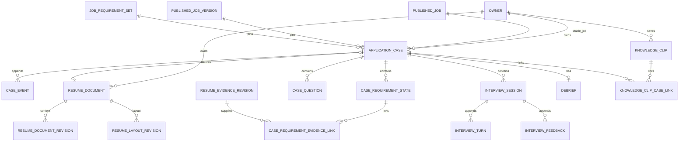

# Career OS 2.0 Phase 2 领域契约与迁移设计

> 【历史归档】本文只保存 Phase 2 当时的契约设计，不提供当前任务。

- 状态：**Historical design record / 已由 migrations 023–030 与 Phase 2B-1/2/3/4A/4B 实现，不是当前任务队列**
- 日期：2026-08-05；Phase 2R 复核：2026-08-06
- 决策者：coco
- 适用阶段：Phase 2
- 当前执行计划：[Career OS 当前交付计划](../career-os-current-delivery-plan.md)
- 历史上位计划：[已废止的 Private Alpha 严格开发总计划](career-os-v2-upgrade-plan-2026-08-04.md)
- 关联决策：[ADR-0005](../../decisions/0005-invitation-session-ownership-retention.md)、[ADR-0007](../../decisions/0007-postgres-task-idempotency.md)、[ADR-0008](../../decisions/0008-immutable-match-versioning.md)、[ADR-0012](../../decisions/0012-isolated-resume-document-ingestion.md)、[ADR-0013](../../decisions/0013-local-ai-recommendation-and-resume-tailoring.md)、[ADR-0023](../../decisions/0023-enforce-runtime-and-database-role-boundaries.md)、[ADR-0030](../../decisions/0030-adopt-job-centric-career-os-and-interaction-first-integration.md)、[ADR-0031](../../decisions/0031-long-lived-career-os-architecture-realignment-2026-08-06.md)

本文冻结 Phase 2 的领域、数据库、HTTP、删除、任务与迁移契约。它是实现设计，不是迁移本身；通过本设计只允许开始第一个 additive 切片，不代表 Phase 2 数据库 Gate 已通过。

## 1. 本切片结论与非目标

原设计已支撑 migrations 023–030 和对应 owner-protected 服务的历史实现。本文件保留为领域基线，正文中的“当前”“下一切片”只描述 2026-08-05/06 当时状态；冲突时以动态路线、当前交付计划和交接为准。

固定非目标：

- 不访问真实招聘来源，不调用真实 AI，不处理真实简历。
- 不购买或部署服务器，不创建第二套认证、数据库、队列、AI SDK 或用户事实库。
- 不回填或改写任何既有 Resume V1 行。
- 不执行 contract migration，不删除旧表、旧列、旧路由或旧状态。
- 不在没有隔离 PostgreSQL 结果时宣布 Phase 2 迁移 Gate 通过。
- 不把 30 天自动删除继续作为用户创建/确认职业资产的默认规则；相关现有迁移约束标记为待复核。
- 不把 Case 绑定限制为公共 `published_job_id`；私有 JD 必须 owner-only 且不进入公共目录。

## 2. 现状盘点：复用、扩展与禁止重复

## 2R. 长期 Career OS 修正覆盖

在开始 migration 025–027 前，以下契约必须以 ADR-0031 为准重新冻结：

- 职业资产默认长期保留，用户主动删除；原始上传、临时抽取文本和导出物继续按 24 小时最小保留处理。
- Case 岗位来源为 `PublicJobReference | PrivateJobSnapshot`。私有快照只对 owner 可见，不进入公共岗位目录、推荐、供给分母或跨用户去重，可无官方 URL，但必须显示核验提示。
- Resume V2 分为语义内容修订、布局修订和独立 Resume Review 聚合；`suggestionDecision` 不再作为正文 block 的业务真源。
- `Account + EmailIdentity` 进入稳定规划，邮箱验证码优先；匿名 owner 只作为本地兼容迁移，不在本阶段切换登录。
- `case_events.event_data`、布局 settings、review finding/suggestion 改为版本化 strict Schema，禁止任意 JSON 写入正文或模型输入。
- `applications`/Case 工作台是唯一业务真源，旧 `/resume`、`/recommendations`、`/insights` 只能跳转或只读，不得产生第二套写入。

Phase 2R 退出 Gate：完成 ADR、契约草案、迁移影响矩阵、删除矩阵、旧路由真源规则和测试矩阵；随后才决定继续、修改、回退或停止。

| 现有能力 | 代码/数据库事实 | Phase 2 处理 |
|---|---|---|
| owner 与会话 | `identity.owners` 有 `status/epoch/retention_expires_at/deleted_at`；会话固定 `owner_epoch`、CSRF 与到期时间 | 复用；客户端永远不能提交 owner |
| 删除墓碑 | `decision.owner_deletions`、owner epoch 递增、会话撤销、90 天无正文墓碑/审计清理 | 复用；不为 Case 再造 owner 墓碑 |
| 迟到任务拒绝 | `task_queue.tasks` 固定 owner epoch；租约、心跳、fencing token；提交时锁 owner 与任务 | 复用；只扩充受控任务类型和 payload |
| 岗位真源 | `catalog.published_jobs` 是稳定岗位；`published_job_versions` 与 `job_requirement_sets` 是不可变版本 | Case 固定三者，不复制岗位/JD |
| 用户事实与证据 | `profile_fact_revisions`、`job_preference_revisions`、`resume_evidence_revisions` 是 owner 级不可变修订 | 只引用已确认修订，不建立 Case 私有事实库 |
| Resume V1 | 已有 `profile.resume_document_revisions`，schema 固定 `resume-document-v1`，修订号是 owner 全局序列 | 原表 additive 扩展；旧行保持原值，读取走转换器 |
| 简历优化与导出 | `matching.resume_tailoring_runs/segments/resume_exports` 已具备引用、四态、模板降级和 24 小时导出 | 复用服务；以后增加 Case/Resume V2 固定引用 |
| 旧岗位决定 | `decision.job_decisions` 保存五态及乐观修订 | 保留兼容入口；新 Case 成为新工作台真源 |
| 运行角色 | 五个 `NOLOGIN` 角色；任务表按 `crawl`/owner 任务 RLS 隔离 | 新 schema/table 必须显式授权；不得依赖迁移 021 的历史 `ALL TABLES` |
| Problem Details | RFC 9457 形状、稳定 `code`、correlation ID 已存在 | 复用并补充 Career OS 稳定错误码 |
| owner 响应缓存 | 当前 `onSend` 只覆盖已登记 owner 路由前缀 | 新增 `/v1/application-cases`、`/v1/resume-documents`、`/v1/interview-sessions`、`/v1/knowledge-clips` 前缀 |

明确禁止：第二张 Case 岗位表、第二张证据表、第二个任务队列、第二个删除墓碑、第二套会话、将 Knowledge Clip 当岗位事实、把 Case 三态写回匹配结果。

## 3. 领域边界与关系图



Schema 归属固定为：

- 新建 `application` schema：Case、要求状态、问题、面试、复盘和 Knowledge Clip。
- 沿用 `profile` schema：Resume V2 文档聚合、内容修订、布局修订。
- 沿用 `matching` schema：匹配、tailoring、导出。
- 沿用 `decision` schema：旧决定兼容和 owner 删除墓碑。

## 4. 跨表共同约束

### 4.1 标识、owner 与时间

- 聚合、修订和事件主键继续使用 `uuid DEFAULT gen_random_uuid()`，与仓库现状一致；不为当前规模引入新扩展或另一种 ID 生成器。
- `requirement_id`、`evidence_id`、区块 ID 是现有契约内的稳定字符串，数据库使用非空 `text`；不能假设它们都是 UUID。
- 所有个人数据表都带 `owner_id`、`owner_epoch`。跨个人表外键优先使用 `(owner_id, id)` 复合键，数据库直接拒绝跨 owner 连接。
- `owner_epoch` 是创建时快照，不对 `identity.owners(id, epoch)` 建外键。删除时必须先递增 owner epoch，若建立该外键会阻止删除撤销或错误级联更新旧数据；活动 owner/epoch 仍由同一事务锁和服务校验。
- Phase 2R 修正：职业资产顶层聚合不再默认设置创建后 30 天 `expires_at`。用户主动删除是默认生命周期；原始上传、临时解析和导出物仍有独立短期保留。旧 023/024 的 `expires_at` 约束只能作为历史实现，需在 Phase 2R 迁移影响矩阵中决定前向修复方式。
- 顶层聚合包含 `deleted_at` 以支持单项删除；owner 全量删除仍物理清除个人表，保留的只有无正文 owner 墓碑和审计。
- 所有时间使用 `timestamptz`。列表使用 `(updated_at, id)` 或 `(created_at, id)` 的 keyset cursor，不使用深分页 OFFSET。

### 4.2 修订、不可变与锁顺序

- `application_cases.revision` 是 Case 聚合的乐观修订号。Case 内每次有效写入在同一短事务内锁 Case，校验 `expectedRevision`，递增一次 revision，并追加一条相同序号的 `case_events`。
- 要求状态、证据连接和问题行上的 `revision` 表示最后修改它的 Case revision，不建立第二套并发序列。
- Resume 文档聚合、Interview Session、Debrief 和 Knowledge Clip 各自有乐观 `revision`。
- `case_events`、Resume 内容/布局修订、interview turns/feedback 使用禁止 UPDATE 的触发器；纠错通过追加新事件或修订完成。
- 锁顺序固定为 `owner -> task（如有） -> aggregate -> child`；外部模型调用和 DOCX 生成在数据库事务外执行，完成写入再校验 owner lease。
- 每个外键列都有普通或复合索引；活动行、待处理任务和未删除聚合使用部分索引。

## 5. ApplicationCase 数据契约

### 5.1 `application.application_cases`

Phase 2R 后，岗位上下文采用联合类型：

```text
PublicJobReference { published_job_id, published_job_version_id, requirement_set_id }
PrivateJobSnapshot { snapshot_id, owner_id, source_label, official_url?, content_revision, requirement_set_revision }
```

两者共享 Case 阶段、结果、修订和删除契约。私有快照不建立公共目录外键，不参与推荐和供给统计；同一 owner 对同一岗位上下文只允许一个未结束 Case。

| 列 | 类型与规则 |
|---|---|
| `id` | UUID 主键 |
| `owner_id`, `owner_epoch` | owner 快照；`owner_epoch > 0` |
| `published_job_id` | 稳定岗位 UUID |
| `published_job_version_id` | 固定岗位版本 UUID |
| `requirement_set_id` | 固定要求集 UUID |
| `stage` | `interested/preparing/applied/interviewing/resolved` |
| `outcome` | 非 resolved 时必须为 NULL；resolved 时为 `offer/rejected/withdrawn/expired/unknown` |
| `revision` | 正整数，初始 1 |
| `creation_idempotency_key` | 1–200 字符；owner 内唯一 |
| `creation_request_hash` | 64 位小写 SHA-256 |
| `expires_at` | Phase 2R 待复核；不得作为职业资产默认自动删除依据 |
| `ended_at` | 仅 resolved 非空 |
| `deleted_at` | 单 Case 删除标记 |
| `created_at`, `updated_at` | 创建/最近写入时间 |

数据库约束：

- 增加 `catalog.published_job_versions(published_job_id, id)` 唯一约束，使 Case 的 `(published_job_id, published_job_version_id)` 可用复合外键固定。
- 增加 `catalog.job_requirement_sets(published_job_version_id, id)` 已有唯一约束的复用外键，保证要求集属于固定版本。
- `UNIQUE (owner_id, id)` 供所有 Case 子表做 owner 复合外键。
- 部分唯一索引：`(owner_id, published_job_id) WHERE ended_at IS NULL AND deleted_at IS NULL`，数据库保证同一 owner/稳定岗位最多一个未结束 Case。
- 列表索引：`(owner_id, updated_at DESC, id DESC) WHERE deleted_at IS NULL`；到期索引只保留给原始文件、导出物和显式短期任务，不用于职业资产自动删除。

### 5.2 `application.case_events`

列：`id`、`owner_id`、`owner_epoch`、`case_id`、`sequence`、`event_type`、`actor_type`、`event_data jsonb`、`idempotency_scope`、`idempotency_key`、`request_hash`、`created_at`。

约束：

- `UNIQUE (owner_id, case_id, sequence)`；`sequence` 等于写入后的 Case revision。
- `UNIQUE (owner_id, idempotency_scope, idempotency_key)`；同键同 hash 返回原结果，不同 hash 返回 `409 IDEMPOTENCY_KEY_REUSED`。
- `event_data` 只保存状态、版本 ID、引用 ID 和无正文原因码，不复制 JD、简历、回答或 AI 输入。
- 禁止 UPDATE。owner 全量删除或 Case 单项删除时随 Case 物理删除，不进入 90 天安全审计。

事件类型首轮固定为：

`case_created`、`stage_transitioned`、`outcome_corrected`、`job_version_upgraded`、`requirement_state_changed`、`requirement_evidence_changed`、`question_added`、`question_updated`、`official_link_opened`、`manual_application_recorded`、`resume_document_derived`、`interview_started`、`debrief_confirmed`。

### 5.3 要求状态、证据连接和问题

`application.case_requirement_states`：

- 主键 `id`；包含 owner、Case、固定 `requirement_set_id`、`requirement_id text`、`state`、`user_note`、`revision`、时间。
- `state` 只允许 `confirmed/needs_work/unconfirmed`。
- `UNIQUE (owner_id, case_id, requirement_set_id, requirement_id)`。
- `user_note` 最长 2000 字；不能把系统推断写成用户确认事实。

`application.case_requirement_evidence_links`：

- 包含 owner、Case、要求集、要求 ID、`evidence_revision_id`、`evidence_id text`、`revision`、`linked_at`、`removed_at`。
- 复合外键保证 Case、要求状态和证据修订都属于同一 owner。
- 自然键唯一；移除只设置 `removed_at` 并追加 Case event，重新连接清空 `removed_at` 并产生新 revision。
- 服务必须解析不可变 evidence revision，确认 `evidence_id` 存在且 `confirmed=true`；数据库不能对 JSONB 数组内 ID 建可靠外键，因此该检查必须有集成测试。

`application.case_questions`：

- 包含 owner、Case、可选要求集/要求 ID、`question`、`answer`、`status`、`revision`、时间。
- `status` 为 `open/answered/dismissed`；`answered` 才能有非空 answer，`open` 不得有 answer。
- 问题最长 1000 字，回答最长 3000 字；未知信息不因创建问题而自动变成已确认。

### 5.4 Case 状态机

```text
interested -> preparing | resolved
preparing  -> interested | applied | resolved
applied    -> interviewing | resolved
interviewing -> applied | resolved
resolved   -> 终态；如需再次求职，为同一稳定岗位创建新 Case
```

- 进入 `resolved` 必须同时提供 outcome 和 `ended_at`。
- 非 `resolved` 的 outcome/ended_at 必须为空。
- resolved 的 outcome 可以通过 `outcome_corrected` 在 expectedRevision 保护下纠正，但不能把 Case 重新打开。
- 打开官方链接只追加 `official_link_opened`，绝不自动迁移到 `applied`。
- `applied` 只能来自用户显式的 `manual_application_recorded`/阶段操作。
- 岗位版本升级必须提供目标版本、当前 Case expectedRevision 和 Idempotency-Key；事务记录旧/新岗位版本与要求集。旧 Resume/Interview 继续引用原版本，不级联改写。

## 6. Resume Document V2 数据契约

### 6.1 `profile.resume_documents`

Phase 2R 补充：Resume V2 的语义正文、布局和审查过程必须分层。`resume_document_revisions` 只承载正文语义；`resume_layout_revisions` 只承载模板/顺序/token；新增 `resume_review_runs`、`resume_review_findings`、`resume_review_suggestions` 和 `resume_review_decisions` 承载审查证据。建议决定不得直接改变正文，正文更新必须创建新的 content revision。

| 列 | 规则 |
|---|---|
| `id`, `owner_id`, `owner_epoch` | 文档聚合与 owner 快照 |
| `kind` | `base/case_derived` |
| `title` | 1–200 字；属于个人数据 |
| `case_id`, `detached_from_case_id` | base 必须全 NULL；case_derived 创建时固定同 owner Case，后续只允许按删除契约显式脱离 |
| `job_context_kind` 与 public/private JobContext 列 | 派生文档固定创建时的公共岗位版本/要求集或 owner-only 私有 JD revision；base 全部为 NULL |
| `base_document_id`, `base_document_revision_id`, `evidence_revision_id` | 派生文档固定基础简历及其 strict content revision、已确认证据 revision；base 全部为 NULL |
| `current_content_revision_id`, `current_layout_revision_id` | 受约束的活动指针，建表后再添加复合外键 |
| `revision` | 聚合乐观修订号 |
| `creation_idempotency_key`, `creation_request_hash` | owner 内创建幂等 |
| `expires_at`, `deleted_at`, `created_at`, `updated_at` | 生命周期 |

约束：

- `case_derived` 的 Case、JobContext、基础正文与证据引用必须组成一组合法 public/private 固定上下文；`base` 必须全部为空。
- 同一未删除 Case 首轮最多一个 `case_derived` 文档；base 文档可有多个。
- 所有个人引用使用 owner 复合外键；岗位版本/要求集使用版本归属复合外键。

### 6.2 additive 扩展 `profile.resume_document_revisions`

迁移 024/027 已在不修改旧行值的前提下新增或前向修正以下 nullable 列：

- `document_id uuid`
- `document_revision integer`
- `base_document_revision_id uuid`

迁移 030 为持久幂等回执和 legacy 唯一来源追加 nullable `legacy_source_revision_id`、`mutation_idempotency_key`、`mutation_request_hash`、`result_document_revision`；旧行全部保持 NULL、值不改。

配对约束：

- 旧 V1：`schema_version='resume-document-v1'` 且 document 链、legacy 来源和 mutation 回执列全部 NULL。
- 新语义正文：`schema_version='resume-content-v1'`、`document_id/document_revision` 非空、`document_revision > 0`；首修订的 `base_document_revision_id` 为 NULL，后续指向同 owner、同 document 的上一内容修订。
- 保留既有 owner 全局 `revision/base_revision` 列；新正文继续获得唯一 owner 全局 `revision` 以兼容旧唯一约束，但服务将 `base_revision` 写为 NULL，真实链只使用 `base_document_revision_id`，防止不同文档通过旧全局链互相阻塞删除。并发与展示使用文档聚合 revision 和 `document_revision`。
- 新增 `UNIQUE (owner_id, document_id, document_revision)` 和同文档 base 复合外键。
- mutation key 以 `(owner_id, document_id, key)` 唯一；同键同请求从不可变行恢复原始 `result_document_revision`，同键不同请求返回冲突。
- `legacy_source_revision_id` 只允许首个 `resume-content-v1` 修订引用同 owner/epoch 的真实 V1 行；同一 legacy 来源只能初始化一个 V2 基础简历真源。
- V2 内容仍存结构化 sections；语义区块/证据 ID 在编辑和换模板时稳定。内容修订继续禁止 UPDATE。审查建议不再写入正文 block 状态。

### 6.3 `profile.resume_layout_revisions`

列：`id`、owner、`document_id`、`layout_revision`、`base_layout_revision`、`template_key`、`section_order`、版本化 `settings`、`content_hash`、mutation 回执、`created_at`。

- `template_key` 首轮只允许 `cn_classic_single_column/cn_compact_technical`。
- `section_order` 只含稳定 section ID；`settings` 只含布局 token，不得复制正文或证据，且必须通过 strict layout Schema。
- owner/document/revision 唯一；同文档 base 外键；禁止 UPDATE。
- mutation key 在 owner/document 内唯一；重放返回当次聚合 revision，不以当前 pointer 伪造历史结果。
- 换模板或章节排序只创建布局修订，不创建内容修订，不改变 block/evidence ID。

### 6.4 V1 只读转换与首次编辑

```text
读取旧 owner 最新 V1 行
-> 转换器暴露 virtual legacy document（ID 使用该 V1 revision ID）
-> 不插入、不回填、不修改旧行
-> 用户先显式创建一个空 base ResumeDocument（聚合 revision=1）
-> 用户第一次编辑该空聚合时提交 legacySourceRevisionId + expectedRevision=0
-> 同一事务创建 content revision 1 + 默认 layout revision 1，并推进两个 pointer 和聚合 revision
-> 后续只在该 document 内追加 V2 修订
```

- 旧 `/v1/profile/document` 在 V2 写入开放前改为只读取 `schema_version='resume-document-v1' AND document_id IS NULL`，旗标关闭时不会误把 V2 当 V1。
- `GET /v1/resume-documents/legacy-source/:legacySourceRevisionId` 只转换当前 owner/epoch 的最新 V1 来源，零写入；跨 owner、旧 epoch、非最新或非 V1 均不可枚举为有效来源。
- `expectedRevision=0` 是“已存在的 base 聚合仍为空”的显式哨兵，不等于聚合真实 revision；服务必须同时验证聚合仍为初始 base 且 content/layout pointer 均为空，禁止从 legacy 隐式创建第二个聚合。
- 转换器必须保留所有 V1 section/block ID；首次 V2 修订的内容 hash 基于规范化 V2 DTO。
- Case-derived 聚合第一次写正文使用其真实 `expectedRevision`，并要求正文 section/block ID 集与创建时固定的基础 content revision 完全一致。
- V1 行永久只读；G4 前不回填 document_id，也不 contract 旧列。

## 7. Interview、Debrief 与 Knowledge 数据契约

### 7.1 `application.interview_sessions`

列：`id`、owner、Case、固定岗位版本/要求集、`evidence_revision_id`、可选 `resume_document_revision_id`、`mode`、`status`、`template_version`、可选 `prompt_version/provider_adapter/model`、`revision`、`creation_idempotency_key/request_hash`、`expires_at`、`completed_at`、`deleted_at`、时间。

- mode 为 `template/controlled_ai`；Private Alpha 默认 template。
- template 模式的 provider/model/prompt 必须全空；controlled_ai 必须全部非空且仍受环境 Gate。
- status 为 `queued/active/completed/failed/deleted`。
- Session 固定 Case 当时的岗位版本、要求集、证据修订和可选 Resume V2 内容修订；Case 后续升级不改 Session。

`application.interview_turns` 为追加表：owner、Session、`sequence`、`kind`、`content`、`requirement_ids jsonb`、`evidence_ids jsonb`、`created_at`。kind 为 `question/answer/follow_up`；Session 内 sequence 唯一；禁止 UPDATE。

`application.interview_feedback` 为追加表：owner、Session、`revision`、`feedback jsonb`、要求/证据引用、`generator_mode`、`created_at`；Session 内 revision 唯一；禁止 UPDATE。服务拒绝不存在、跨 Case 或未确认的 evidence ID。

### 7.2 `application.debriefs`

- 每个未删除 Case 最多一个 Debrief 聚合。
- 列：`id`、owner、Case、可选 Session、`expression_issues jsonb`、`evidence_gaps jsonb`、`practice_plan jsonb`、`status`、`revision`、`confirmed_at`、`expires_at`、`deleted_at`、时间。
- status 为 `draft/confirmed`；confirmed 必须有 `confirmed_at`。
- 复盘只描述表达问题、证据缺口和练习计划。它不能直接插入 `resume_evidence_revisions`；后续“转成经历表达”必须进入单独的用户确认请求并产生新 evidence revision。

### 7.3 `application.knowledge_clips`

- 列：`id`、owner、`url`、`title`、`summary`、`use_cases jsonb`、`user_notes`、`verified_at`、`revision`、创建幂等字段、`expires_at`、`deleted_at`、时间。
- URL 只接受 HTTPS，最长 2048；title 300、summary 2000、user notes 5000 字；use cases 最多 20 条。
- 明确没有 `body/html/raw_content/snapshot` 字段；系统不抓全文，不自动刷新 URL。
- `application.knowledge_clip_case_links` 只保存 owner、clip、Case 和 created_at，复合外键拒绝跨 owner；删除任一聚合级联删除关联。

## 8. HTTP 契约

所有接口从安全 Cookie 派生 owner，owner 级响应 `Cache-Control: no-store, Pragma: no-cache`，写请求走现有同源与 CSRF hook。创建/追加型 POST 要求 1–200 字符 `Idempotency-Key`；所有状态更新携带 `expectedRevision`。

### 8.1 Case 与要求

| 方法与路径 | 核心输入/行为 |
|---|---|
| `GET /v1/application-cases?cursor&limit&stage` | `(updatedAt,id)` 游标，稳定排序 |
| `POST /v1/application-cases` | `{publishedJobId,publishedJobVersionId}`；固定当前要求集；已有未结束 Case 时返回该 Case，不静默升级 |
| `GET /v1/application-cases/:caseId` | 同 owner 详情；不存在/越权同一 404 |
| `POST /v1/application-cases/:caseId/transitions` | `{expectedRevision,toStage,outcome?,reason?}`；追加事件 |
| `GET /v1/application-cases/:caseId/job-version-diff` | 确定性旧/新版本差异；无写入 |
| `POST /v1/application-cases/:caseId/job-version-upgrades` | `{expectedRevision,targetPublishedJobVersionId}`；显式升级 |
| `GET /v1/application-cases/:caseId/requirements` | 固定要求集、三态、链接、问题 |
| `PUT /v1/application-cases/:caseId/requirements/:requirementId` | `{expectedRevision,state,userNote}` |
| `PUT /v1/application-cases/:caseId/requirements/:requirementId/evidence-links` | `{expectedRevision,evidenceRevisionId,evidenceIds[]}`；以期望集合做原子差分 |
| `POST /v1/application-cases/:caseId/questions` | `{expectedRevision,requirementId?,question}` |
| `PUT /v1/application-cases/:caseId/questions/:questionId` | `{expectedRevision,status,answer?}` |

### 8.2 Resume、Interview、Debrief、Knowledge

| 接口族 | 固定语义 |
|---|---|
| `/v1/resume-documents` | 列表、创建 base/derived、详情；列表顶层只暴露最新 V1 来源摘要，不把它伪装成聚合 |
| `/v1/resume-documents/legacy-source/:legacySourceRevisionId` | 只读转换当前 owner/epoch 最新 V1 正文；GET 零写入 |
| `/v1/resume-documents/:id/revisions` | 内容修订；POST 同时要求幂等键和文档 `expectedRevision` |
| `/v1/resume-documents/:id/layout-revisions` | 模板/排序修订，不接收语义正文 |
| `/v1/application-cases/:caseId/resume-tailorings` | 适配现有 tailoring；固定 Case、岗位版本、Resume V2 与证据修订 |
| `/v1/application-cases/:caseId/resume-exports` | 复用现有 DOCX 导出；文件最长 24 小时 |
| `/v1/application-cases/:caseId/interview-sessions` | 创建/列表固定输入的 Session |
| `/v1/interview-sessions/:sessionId/turns` | 追加回答或读取 turn；不能替用户生成事实 |
| `/v1/interview-sessions/:sessionId/next-question` | 异步生成下一题；返回 202 operation |
| `/v1/interview-sessions/:sessionId/feedback` | 异步生成/读取结构化反馈 |
| `/v1/application-cases/:caseId/debrief` | GET/PUT；PUT 使用 expectedRevision |
| `/v1/knowledge-clips` | keyset 列表、创建、读取、更新、单项删除与 Case 关联 |

### 8.3 公共类型与 Problem Details

公共 Zod 类型固定：

```ts
type CaseStage = "interested" | "preparing" | "applied" | "interviewing" | "resolved";
type CaseOutcome = "offer" | "rejected" | "withdrawn" | "expired" | "unknown";
type RequirementEvidenceState = "confirmed" | "needs_work" | "unconfirmed";
type ResumeSuggestionDecision = "pending" | "accepted" | "edited" | "rejected";
type InterviewMode = "template" | "controlled_ai";
```

稳定错误码：

| HTTP | code | 条件 |
|---:|---|---|
| 400 | `INVALID_APPLICATION_CASE_REQUEST` | 请求结构或 ID 格式错误 |
| 404 | `APPLICATION_CASE_NOT_FOUND` | 不存在、已删除或跨 owner，响应不可区分 |
| 404 | `RESUME_DOCUMENT_NOT_FOUND` / `INTERVIEW_SESSION_NOT_FOUND` / `KNOWLEDGE_CLIP_NOT_FOUND` | 同上 |
| 409 | `APPLICATION_CASE_REVISION_CONFLICT` | expectedRevision 过期；detail 可返回当前 revision，不返回其他内容 |
| 409 | `RESUME_DOCUMENT_REVISION_CONFLICT` | 文档并发修改 |
| 409 | `INVALID_CASE_TRANSITION` | 不合法阶段迁移或 outcome 配对 |
| 409 | `IDEMPOTENCY_KEY_REUSED` | 同 owner/scope/key 对应不同 request hash |
| 409 | `JOB_VERSION_UPGRADE_REQUIRED` | 创建/操作引用的版本与 Case 固定版本不同 |
| 410 | `OWNER_RESOURCE_EXPIRED` | 当前 owner 可证明拥有但资源已到期；跨 owner 仍为 404 |
| 422 | `REQUIREMENT_REFERENCE_INVALID` | 要求 ID 不属于固定要求集 |
| 422 | `EVIDENCE_REFERENCE_INVALID` | 证据未确认、不存在或不属于固定 evidence revision |
| 422 | `DEBRIEF_CONFIRMATION_REQUIRED` | 试图绕过用户确认生成经历表达 |

错误继续使用现有 Problem Details：`type/title/status/code/correlationId/detail?/instance?/errors?`，不返回 SQL、堆栈、owner、供应商正文或对象归属。

## 9. 旧决定兼容契约

| 旧状态 | 新 Case 表示 |
|---|---|
| `undecided` | 不创建 Case |
| `saved` | `interested` |
| `preparing_to_apply` | `preparing` |
| `applied` | `applied` |
| `abandoned` | `resolved/withdrawn` |

- Phase 3A 起，新 Case 是工作台真源。
- 旧 PUT 在可无损表示时与 Case 事务内双写；官方链接打开事件只记录打开，不更新阶段。
- 无法无损表示的新状态（如 interviewing、offer/rejected/expired）写回旧五态接口时返回 `409 CAREER_OS_STATE_NOT_REPRESENTABLE`，引导进入新工作台。
- 旧表和路由 G4 前保留；不从历史 `undecided` 批量创建 Case。

## 10. 任务、权限与迟到写入

新增 task types：`interview_generate`、`interview_feedback`、`debrief_generate`。它们继续满足用户任务上下文：source 字段全 NULL，`owner_id/owner_epoch` 非空，payload 只含 `caseId/sessionId/debriefId/runId/requestHash` 等 ID，不含 JD、简历、回答、反馈、提示词或模型输入正文。

执行规则：

1. Web 在短事务内验证 owner/Case/固定输入，创建业务运行行与任务。
2. `match-worker` 通过当前任务 RLS、`FOR UPDATE SKIP LOCKED`、租约、心跳和 fencing token 领取。
3. 确定性模板或受控 provider 调用在事务外执行；本阶段测试只用离线模板和模拟端点。
4. 完成事务重新锁 owner、任务、聚合，校验 epoch、到期、租约和固定版本；任一失效拒绝写入。
5. owner 删除先把除 deletion 外的 queued/running 用户任务置 dead 并递增 epoch；迟到 Worker 不能恢复内容。

权限：

- `aijob_web_api`：新 application/profile 表的 owner 路由所需 SELECT/INSERT/受限 UPDATE/单项 DELETE。
- `aijob_match_worker`：任务处理所需 SELECT/INSERT/受限 UPDATE，以及完成 owner 删除所需 DELETE；不能读取会话 token/hash 或采集正文。
- `aijob_collector_worker`：不授予 `application`/`profile` 新表 USAGE 或数据权限。
- `aijob_ops_cli`、`aijob_migrator`：按既有职责授予。
- 每次迁移显式 GRANT/REVOKE；不依赖 default privileges 或迁移 021 对当时既有表的授权。

## 11. owner 删除、TTL 与单项删除矩阵

| 数据族 | 单项删除 | owner 删除顺序 | 最长保留 |
|---|---|---:|---:|
| 新 interview feedback/turn/session | Session 软删后异步物理级联；用户可单项删除 | 1 | 长期，用户主动删除 |
| Debrief | 聚合软删后物理删除；Case 删除时询问是否级联 | 2 | 长期，用户主动删除 |
| Knowledge links/clips | 关联/Clip 可单独物理删除 | 3 | 长期，用户主动删除 |
| Case requirement links/states/questions/events | 随 Case 删除；派生资产不默认一并删除 | 4 | 随 Case，用户主动删除 |
| Resume layout/content revisions/documents | 文档可单项删除；Case 派生文档可选择级联；V1 仍由 owner 删除 | 5 | 长期，用户主动删除 |
| 既有 exports/tailoring/recommendation/match/insight | 导出先删除；业务历史可单项删除 | 6 | 导出 24 小时；其余长期 |
| 旧 job decisions | 物理删除 | 7 | 长期，用户主动删除 |
| profile evidence/preferences/facts/analyses | 原文确认即删、异常最迟 24 小时；结构化资产可单项删除 | 8 | 原文 24 小时；结构化长期 |
| owner tasks/sessions | 非删除任务先 dead/删，最后删会话 | 9 | 不晚于 owner |
| `identity.owners` + `decision.owner_deletions` + 无正文 audit | 保留墓碑后按现有维护清理 | 90 天 |

实现时必须先显式删除引用 Resume/证据/Case 的新表，再删除被引用的旧修订。全部新个人表进入 `processOwnerDeletion` 和恢复不复活集成测试；不能只依赖 ORM 级联后假设完成。

## 12. additive 迁移与实现顺序

所有 migration `down` 对已产生个人不可变历史的部分采用前向修复；G4 前不 contract。

0. **Phase 2R**：先完成 ADR-0031 规定的生命周期、私有 JD、Resume Review、身份和 strict Schema 复核；023/024 只能作为历史实现，不能直接向下追加。
1. **023 前向修复/兼容评估**：复核 `application` schema 的公共岗位外键、长期生命周期、事件 Schema 和私有快照扩展；必要时只做 additive 前向修复。
2. **024 前向修复/兼容评估**：复核 `resume_documents`/layout revisions 的生命周期和 V1/V2 配对；新增 Review 聚合，旧行保持可读。
3. **025 `interview_debrief_knowledge_expand`**：仅在 Phase 2R 决定为继续后新增三域表、复合 owner 外键、索引、触发器和权限。
4. **026 `career_os_owner_tasks_expand`**：扩充 task type CHECK、contracts、worker allowlist/payload schema；先只支持离线 stub，尚不接真实 AI。
5. **027 `career_os_deletion_and_compatibility_expand`**：按新删除矩阵扩展兼容、no-store 和权限测试。
6. **服务/API 切片**：迁移全部可在旧应用下运行后，才逐个接 ApplicationCase、Resume V2、Interview；每次只开放一个功能旗标内纵向切片。

每条迁移先在空库 `001 -> latest`，再在含 V1/旧决定/任务数据的 022 fixture 上升级；比较旧 API 的响应与约束，证明 additive。不得把 migration 021 的角色对象复制到测试绕过权限结果。

## 13. 契约与 PostgreSQL 测试草案

### 13.1 Contracts

- 五个公共枚举只接受固定值；Case outcome/stage 配对非法时拒绝。
- create/update body 使用 strict object，拒绝客户端 owner/epoch/expiresAt。
- cursor 包含完整排序列，篡改或缺列返回 400。
- Resume V1 virtual DTO 与 V2 DTO 可区分；V1 update 请求只能进入首次转换命令。
- Interview controlled_ai 缺 provider version、template 带 provider 字段、Knowledge 非 HTTPS/超长正文均拒绝。
- Problem Details 继续通过共享 schema，404 不包含对象归属。

### 13.2 PostgreSQL 集成

- 022 fixture 升级 023–027 后旧行、旧约束、旧接口继续工作；空库全迁移成功。
- 并发创建同 owner/岗位只产生一个未结束 Case；不同 owner 可各自创建。
- Case 固定版本/要求集归属，显式升级追加事件且不改旧 Resume/Interview。
- Case/Resume/Interview/Knowledge 的所有复合 owner FK 拒绝跨 owner。
- expectedRevision、同键同 hash 重放、同键不同 hash 冲突、事件序号并发均确定。
- V1 行升级前后列值与 hash 不变；首次编辑只新增文档和 V2 修订；两文档修订号互不串联；换模板不改 content hash/区块 ID。
- 任务类型 RLS：collector 看不到新用户任务；Web/match 看不到 crawl 或原始快照；新任务 payload 不含正文。
- owner epoch 变化、TTL 到期、租约过期、fencing 变化均拒绝迟到 Interview/Debrief 写入。
- owner 删除覆盖每张新表、任务和导出；刷新/重新建会话/恢复 fixture 不复活个人数据；90 天墓碑/审计无正文。
- 角色权限测试验证新表显式 grants；缺少 grant 必须 fail closed。

### 13.3 工程与回退

- 每个切片运行 `git diff --check`、lint、typecheck、隔离 PostgreSQL test、全仓 test、build、audit 与 secret/schema/link 检查。
- 迁移 Gate 无隔离 PostgreSQL结果时只能写“未执行”，不得写“通过”。
- 应用回退用 `VITE_CAREER_OS_V2=false`；新表和新行保留，旧路由只读旧 V1/旧决定，不删除新数据。
- 若 additive 约束导致旧应用失败，停止后续迁移，前向修复；不对个人历史执行 destructive down。

## 14. 已发现冲突与处理

| 冲突 | 处理 |
|---|---|
| 计划写“新增 Resume Document V2”，代码已存在同名修订表 | 明确为新增聚合 `resume_documents` + additive 扩展既有 revisions；禁止重建第二张修订表 |
| 2B-4A 已允许先创建空 base，但旧设计仍写“从 legacy 直接创建新 base”；既有修订表又缺少持久 mutation 回执 | 2B-4B 改为初始化已有空 base；migration 030 additive 增加不可变幂等回执和 legacy 来源唯一绑定。GET 继续零写入，应用回退不删除新列或历史 |
| `docs/05-system-architecture.md` 仍描述受限任务函数，ADR-0023 与迁移 021 已改为任务表 RLS | 本切片同步文档为当前 RLS/直接表访问事实；未来新增外部写入方时再复审函数层 |
| 架构文档写 JobDecision 可选 `match_run_id`，当前表和 ADR-0008 没有该列 | 删除该过时描述；Phase 2 通过 Case 固定上下文，不给旧决定补隐式匹配归属 |
| ADR-0005 要求会话 Cookie `SameSite=Strict`，当前实现为 session `Lax`、CSRF `Strict` | 记录为服务器就绪前安全债；不在本设计切片顺手改变登录导航行为，必须在身份专项测试后处理 |
| 现有 PostgreSQL 任务实现有 RLS，但 Web/match 均能直接访问全部 owner 任务类型 | Phase 2 不新增进程；026 集成测试先验证当前边界，任务类型继续扩张时复审是否按 worker 能力细分策略 |
| 本机没有隔离 PostgreSQL，51 项数据库测试此前未执行 | 设计可接受；023 迁移 Gate 不可接受，下一切片必须先具备隔离数据库结果 |

## 15. 设计 Gate 决定

验收项均已冻结：复用矩阵、外键图、owner/TTL/删除顺序、Case 状态机、V1 转换、API/Problem Details、任务/迟到写入、迁移顺序和 PostgreSQL 测试矩阵。

决定：**继续**到 `Phase 2A-1 ApplicationCase core contracts + migration 023`。该决定不提高产品证据，仍为 `E0`；不开放真实来源、真实 AI、服务器或参与者工作。
