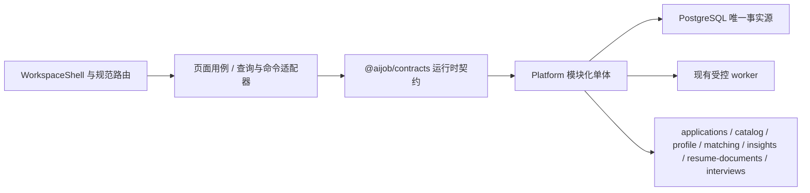

# Aijob Career OS 前后端同步改进当前交付计划

- 状态：**Active / UX-0 审计 Gate 已关闭；OS-1 是下一前后端同步切片，尚未开始产品代码实施**
- 生效日期：2026-08-13
- 当前分支：`codex/career-os-ux-convergence`
- 当前切片：`OS-1 系统外壳与运行契约（待 coco 指令开始）`
- 稳定契约：[Career OS 端到端体验与系统契约](../14-career-os-end-to-end-experience-contract.md)
- 追踪矩阵：[UX-0 页面—系统—证据追踪矩阵](career-os-ux-0-end-to-end-traceability-matrix.md)
- 上一切片关闭证据：[UX-0 端到端契约与基线审计](../evidence/product/career-os-v2/ux-0-end-to-end-contract-and-baseline-2026-08-13.md)
- 动态进度：[MVP 路线与当前决策面板](../06-mvp-roadmap.md)
- 工程入口：[当前项目交接](../handoffs/current.md)
- 上一轮归档：[M0–M4 与 PA-1 交付计划](archive/career-os-m0-m4-pa1-delivery-plan-2026-08-12.md)
- 后续守门：[Private Alpha 与上线就绪 Gate](private-alpha-readiness-gates.md)

## 1. 当前目标

把现有岗位、三轴匹配、推荐、JD 洞察、简历解析与确认、Case、Requirements、Resume V2、Review、旧 Tailoring、投递、面试、复盘、删除和离线身份能力，收敛为一个**数据语义连续、交互自然、视觉统一、可端到端验证**的 Career OS。

本计划不再把后端匹配视为前提。`750/750` 工程基线只证明 M4 候选覆盖过既有闭环，不证明目标信息架构、旧能力归宿、Case 关联、列表投影、路由恢复或最终交互已经端到端匹配。

已确认的纠正原则：

- “优先复用现有后端”是逐项审计后的结论，不是默认假设。
- UX-0 已把每个用户动作绑定到 Contract、Platform 模块、PostgreSQL 事实、权限/并发/删除语义和真实测试；没有绑定的页面不得先做。
- `UX-0` 保留为已关闭的审计名称与实施基线；后续实现统一使用 `OS-1–OS-7`，避免再把里程碑误读为前端 UX 独立优化。
- 每个 OS 切片都按**同切片契约先行**推进：先锁 Contract，再完成 Database/Platform，随即由 Web 消费，最后用真实隔离库联合验收；任何一层单独完成都不能宣称切片完成。
- 旧能力不能仅用“兼容说明还在”冒充“已自然融入”。只有用户能在规范 Career OS 路径中继续使用、刷新后能恢复、数据仍可追溯，才算融合完成。

三张 Career OS 概念图继续作为布局、信息层级和交互关系的高保真目标，不作为业务字段或事实来源。固定产品语义不变：不输出匹配百分比或“匹配良好/中/差”；证据状态只使用`已有证据 / 证据待补充 / 用户尚未确认`。

## 2. 固定系统架构

系统责任固定如下：

- React 负责路由、草稿、可见状态和用户确认，不在浏览器内拼接跨领域事实或补写后端没有的结论。
- `@aijob/contracts` 负责请求、响应、状态枚举和 Problem 语义；Web 对本轮改动过的核心响应必须做运行时 schema 校验，不能只用 TypeScript 泛型强转。
- Platform 继续是一个模块化单体。需要跨领域组合时在现有 Platform 应用层形成显式 read model / command adapter，不新增 BFF、第二套服务或第二套事实源。
- PostgreSQL 继续是唯一查询和任务真源。只有现有表无法持久表达必要关联时才提出最小 migration；必须先在当前切片记录原因、回退和测试，不能在页面实现中顺手添加。
- 正常成功路径只使用真实 Platform API、现有服务和隔离测试库。浏览器拦截只允许注入 loopback 延迟或失败，不能伪造成功业务数据。

## 3. UX-0 已确认的端到端差距

| 能力 | 当前后端事实 | 当前 V2 / Web 事实 | 判定与负责切片 |
|---|---|---|---|
| 身份、owner、CSRF、会话恢复 | 已有 owner 隔离、读请求一次恢复、mutation 不自动重放 | 页面级访问、草稿和错误回接仍不统一 | **部分匹配**；OS-1、OS-7 |
| 岗位检索与详情 | `/v1/jobs` 已有筛选、facet、cursor 和 unknown 语义 | 筛选只在组件 state；排序契约未固定；返回详情会丢状态 | **部分匹配**；OS-2 |
| 公共/私有 Case 与固定岗位版本 | 已有幂等创建、owner 404、固定版本、diff/upgrade、删除资产处置 | 创建与读取已接入；transition、diff/upgrade 未进入 V2 API 适配器和完整交互 | **部分匹配**；OS-3、OS-4 |
| 五阶段看板 | Case 列表只支持 `stage + cursor + limit`，固定按更新时间排序 | 前端没把 stage 传给 API；城市/排序只作用于已加载页面，可能不是完整集合 | **契约缺口**；OS-3 先定列表 read model，再做卡片 |
| Requirements / 证据 / 问题 | 已有三证据状态、引用、问题、revision 409、owner 隔离 | 主路径已接入，检查器、草稿和错误呈现仍不完整 | **主体匹配**；OS-4 同步收敛 |
| 三轴匹配 | matching 服务与 immutable run 已存在，但创建和 Worker 处理都只允许“当前目录指针”的岗位版本 | Case 固定版本可能已不是当前目录版本；V2 又禁用旧匹配动作，Case 没有可恢复入口 | **后端语义缺口**；OS-4 扩展 Case-pinned 执行上下文与恢复 adapter，不新增 Case 外键 |
| 推荐 | recommendation run 可基于候选岗位和资料修订生成 | `/recommendations` 在 V2 只是零请求兼容说明，规范岗位旅程没有承接 | **未自然融合**；OS-2 |
| JD 洞察 | insights 服务是按 scope 的确定性聚合，不是天然的单 Case 能力 | `/insights` 在 V2 只是兼容说明；概念图“单岗位要求”不能误当市场洞察 | **归属已锁定、尚未接入**；市场 Insights 进入 `/jobs/insights*`，Case 只保留单岗 Requirements；OS-2 |
| 简历导入与确认 | 解析、原文保留边界、profile/evidence 确认均已存在 | 仍使用 `/resume*`，规范 `/resumes/import*` 缺失 | **后端主体匹配、入口未融合**；OS-2 |
| Resume V2 / Review / DOCX | 文档、内容/布局修订、模板 Review、逐建议决策、DOCX、删除已存在；但当前模板 Review 没有读取固定岗位 Requirements，Finding/Suggestion 也没有 requirement 引用 | Studio 已接入，但当前 Review 只能证明“证据一致性检查”，不能证明已经完成岗位定制 | **后端语义缺口**；OS-5 同步扩展岗位要求输入、引用契约和真实测试 |
| 旧 Tailoring / 受控 AI | tailoring run 有 provider、去标识化、逐段决策和导出；Resume Review 只开放 template，Worker 也硬编码模板且运行记录缺少生成 provenance | V2 只保留旧 Tailoring 历史只读，新 Review 尚未承接受控 AI | **归属已锁定、迁移范围已证明**；OS-5 以 Review 为唯一新写入并做最小 expand migration，复用低层安全能力而非复活旧写入流程 |
| 投递、面试、复盘 | 显式投递、模板面试、反馈、复盘确认/回流和选择性删除均已存在 | 已接入但 interview/debrief 路由焦点、冲突和错误体验未统一 | **主体匹配**；OS-6 |
| 数据范围与全量删除 | owner 数据范围、删除状态和不可读语义已存在 | 新设置入口已接入，错误与 session 回接需统一 | **主体匹配**；OS-6、OS-7 |
| Web API 边界 | Platform 路由会解析请求，服务/测试大量使用 schema | 通用 `apiRequest<T>` 对大多数响应只是类型断言 | **运行时契约缺口**；从 OS-1 起随切片修正 |
| 浏览器证据 | Platform 集成测试覆盖大量 404/409/幂等/删除语义 | 没有受 CI 管理的完整满态/空态真实 API 浏览器夹具 | **验收缺口**；UX-0 设计，后续切片最小实现，OS-7 总验 |

以上判定是 UX-0 代码与运行反证结果，不等于能力已经实现。详细逐用例事实和字段级契约见[追踪矩阵](career-os-ux-0-end-to-end-traceability-matrix.md)。六个结构性接缝已经形成“复用 / 适配 / 扩展 / 最小迁移 / 排除”方向；实现与最终通过仍由对应 OS 切片负责，不能把审计关闭写成工程功能完成。

### 3.1 已选择的防返工架构

以下选择只锁定实现方向，尚未实施：

1. **看板集合：`E`，无语义 migration。** 扩展 Case list 的 `city / sort / total` 契约，并新增 `GET /v1/application-cases/board` 初始投影，在同一 repeatable-read 快照返回五阶段的首批 items、逐列 total 与 cursor。后续单列加载复用 stage list；浏览器不再对分页子集计算全局筛选、排序或计数。索引只在隔离库 `EXPLAIN`/延迟证据证明需要时单独评审。
2. **三轴匹配：`E`，不新增 Case 外键。** 新增 Case-scoped match adapter：服务端由 Case 固定公共岗位版本、固定 requirement set 和当前已确认资料修订创建/读取 MatchRun，返回 `not_run / current / stale / not_applicable_private`。现有 matching 创建与 Worker 都要求岗位仍是当前目录指针，不能直接复用；OS-4 必须增加只由同 owner、未删除 Case 授权的 `case_pinned` 执行上下文，并把 `caseId` 放进受 schema 约束的任务载荷供 Worker 重验。幂等 hash 同时包含请求与服务端实际解析出的岗位/要求/资料 revisions，防止资料变化后错误复用旧任务。MatchRun 仍归 `matching`，结果不复制进 Case，也不新增 Case 外键。
3. **市场洞察：`A`，明确不进入单 Case JD 面板。** 规范入口为 `/jobs/insights` 与 `/jobs/insights/:runId`；Run ID 是已持久化结果的深链。Case Requirements 只显示单岗官方/私有要求。V2 的旧 `/insights` 改为规范入口兼容跳转，V2=false 仍保留旧页。
4. **推荐：`E`，归入岗位发现但不创建第二种 Run。** 规范页面为 `/jobs/recommended` 与 `/jobs/recommended/:runId`。Platform 在现有 `/v1/recommendation-runs` 资源下增加“按岗位筛选创建”和“带岗位投影读取”adapter，根据规范筛选和当前确认资料在服务器冻结候选集，继续复用现有 RecommendationRun；不再由浏览器先拉取最多 1100 个岗位后提交 ID，也不逐项 N+1。旧 `/recommendations` 在 V2 中跳转新入口。
5. **简历优化：`E + M`，只保留一个新写入所有者。** Resume V2 Review 成为模板与受控 AI 的唯一新写入聚合；旧 Tailoring 保留历史只读。现有 Review 虽预留 `controlled_ai` mode，但请求、路由和 Worker 都只实现 template，生成器也没有使用固定岗位 Requirements，Finding/Suggestion 没有 requirement 引用，Run 缺生成 provenance 与 failure/fallback 说明。OS-5 因此需要一个最小 expand migration：为新 Run 增加不伪造旧数据的版本化 provenance，为 Finding/Suggestion 增加受校验的 `requirementIds`；同时在同一任务队列增加 v2 任务类型，使旧 Worker 不会领取并误处理 v2 Run。必须先部署双读 v1/v2 且同时保留 v1/v2 handler 的 reader/Worker，再启用 template 或 controlled_ai 的任何 v2 写入；一旦存在 v2 Run，pre-v2 应用代码回滚禁止，只能前向修复。实现只抽取可复用的低层 provider、去标识化与结构化校验能力，不让旧 Tailoring 重新成为写入口。AI 关闭或调用失败按 ADR-0013 明确降级模板并记录原因；离线验收只用 loopback 模拟 provider，真实 AI、公开/远程启用仍受原 Gate 约束。
6. **Web 响应契约：`A`。** `apiRequest` 接受运行时 parser，触达的核心 adapter 必须用共享 schema 解析成功响应；解析失败统一为 Shell 内可重试的 `INVALID_API_RESPONSE`，不再把 `apiRequest<T>` 泛型断言当作契约验证。

这些选择保持一个 Platform 模块化单体和一个 PostgreSQL 事实源。字段级请求/响应、Problem、删除/版本语义和核心测试断言已完成 UX-0 反证；Review 的 expand-only、双读/双 handler、v2 写入开关及“存在 v2 Run 后禁止旧代码回滚”也已锁定。四视口当前基线已完成并把失败分配到 OS-1、OS-3、OS-5。

## 4. 串行纵向里程碑

| 切片 | 同步交付范围 | 通过条件 | 状态 |
|---|---|---|---|
| UX-0 端到端契约与基线 | 路由、用户动作、领域归属、API/DB/错误/删除矩阵；视觉 token；满态/空态夹具；四视口当前基线 | 核心路径无未归属能力；每行有复用/适配/扩展决定；浏览器基线完成 | **已完成审计 Gate；不等于功能实现** |
| OS-1 系统外壳与运行契约 | WorkspaceShell、访问/会话、路由错误、统一 overlay/focus；必要的响应 schema 适配 | 规范路由不掉回旧 Shell；真实 session/404/error/deep-link 端到端通过 | **下一切片；尚未开始，等待 coco 指令** |
| OS-2 资料准备与可信岗位入口 | 岗位目录/详情、推荐/洞察归位、简历导入确认、Case 创建与 URL 恢复 | 用户从可信岗位和已确认资料进入 Case；公开/空目录和 unknown 语义不退化 | 待 OS-1 Gate |
| OS-3 申请看板与 Case 命令 | 看板/列表/Peek；列表 read model、分页、筛选、计数、阶段命令和固定版本入口 | 不依赖“已加载子集”得出完整结果；owner/409/幂等/刷新真实通过 | 待 OS-2 Gate |
| OS-4 单 Case 决策与固定版本匹配 | Case Header、Requirements/Evidence、问题、岗位版本与三轴匹配 | 同一固定岗位版本与资料修订可追溯；无匹配总分；刷新后结果可恢复 | 待 OS-3 Gate |
| OS-5 Resume Studio 与唯一 Review 写入 | 基础/岗位简历、修订、Review、DOCX；旧 Tailoring 历史承接 | 不存在两套可写简历流程；草稿/409/证据引用/删除/DOCX 真实通过 | 待 OS-4 Gate |
| OS-6 投递、面试、复盘与数据控制 | 今日、显式投递、面试、复盘、设置、访问、历史只读和兼容 URL | 同一 Case 贯通投递到回流；删除和兼容行为端到端通过 | 待 OS-5 Gate |
| OS-7 系统总 Gate | 全前台视觉、功能、Contracts、Platform、数据库语义、可访问性、性能、离线与回退 | 全新隔离库、全仓质量、四视口、网络/控制台、删除与 flag 回退全部通过 | 待 OS-6 Gate |

原“全部 UX 约 9–12 个有效开发日”估算建立在主要前端收敛假设上，现已撤回。UX-0 已暴露匹配固定版本、岗位定制 Review、列表投影和浏览器夹具的真实后端/运行成本；后续只在每个 OS 切片启动时按其五项状态单独估时，不恢复未经验证的全局总工期。

## 5. 每个切片的固定执行顺序

每个 `OS-*` 切片必须维护同一张五项状态账本：`Contract`、`Database/Platform`、`Web`、`Integrated Gate`、`Evidence`。状态只允许“未开始 / 进行中 / 通过 / 阻塞”；可以拆分提交，但五项全部通过且证据作出继续决定前，里程碑状态不得写成“完成”。

1. **用户结果与事实源**：定义这个页面允许用户完成什么，哪些字段来自哪个领域模块，哪些必须显示 unknown。
2. **契约先行**：固定规范路由、URL 状态、请求/响应 schema、错误码、owner/CSRF、幂等、revision、删除和恢复语义。
3. **数据可表达性**：证明现有表与关联能持久恢复该结果；不能表达时先记录最小 migration 方案与回退，不直接写 UI 绕过。
4. **Platform 实现与集成测试**：优先复用；必要时在现有模块化单体内增加 read model / adapter / query，禁止把跨领域 join 推给浏览器。
5. **Web 实现**：只消费已锁定契约，覆盖 Loading、空态、错误、404、409、session、删除、刷新和历史导航。
6. **真实纵向验收**：合成数据通过真实 Platform API 和全新隔离 PostgreSQL；验证四视口、键盘、console、network、lazy loading 和回退。
7. **证据与决定**：更新独立证据，只作“继续、修改、回退、停止”之一。上一切片未通过，不进入下一切片。

禁止先完成视觉页面、用临时静态数据或成功响应 mock 占位，再把后端关联留到以后补。

## 6. 关键交互约束

### 申请看板

- 桌面使用五阶段看板和右侧 Peek；移动端使用阶段切换、单列卡片和全屏 Peek。
- `view / stage / city / sort / peek` 必须 URL 可恢复；是否由 Case list query、聚合 read model 或受证明的完整本地集合承载，在 OS-3 契约中明确，不能对分页子集静默筛选。
- 卡片只显示 Case 列表 read model 已提供的真实字段；如果概念图需要跨领域进度，先设计无 N+1 的 Platform 投影。
- 不把拖拽作为阶段写入入口；阶段变化只走显式、有 revision 与幂等保护的命令。

### Case、JD 与匹配/洞察

- 单岗位官方 Requirements、用户证据状态、三轴 matching run 和跨岗位市场 insight 是四类不同事实，不得为了贴近概念图合并成“能力匹配分”。
- 所有结果绑定 Case 的固定岗位版本和实际使用的资料修订；岗位版本升级必须显式 diff/确认。
- 右侧检查器只提交后端已有的状态、备注、证据关联和问题；revision 409 保留草稿并要求再次确认。

### 简历工作室

- 左侧为结构、证据和版本；中间为 A4 文稿；右侧为要求、证据和审阅建议。
- 基础简历、岗位简历、模板 Review 与历史 Tailoring 必须形成一个明确的写入所有权；不得并存两套会继续产生不同事实的编辑流程。
- 建议只能接受、编辑后采用或拒绝；不得自动写入或引用未确认事实。
- 移动端使用“结构 / 文稿 / 建议”模式切换，不强行压缩三栏。

## 7. 实现边界

- 保持一个 `WorkspaceShell`、一个 Platform 模块化单体和一个 PostgreSQL 事实源；不新增第二套 Shell、BFF、数据库、Redis、向量库、消息总线、认证体系或 AI SDK。
- 不再写“禁止所有 migration”作为未经审计的结论；但任何 migration 都必须由不可表达的持久语义证明，并在实施前明确记录、测试和回退。纯视觉便利不能成为 migration 理由。
- 看板首屏不得为每张卡片产生 N+1 请求；跨领域摘要由 Platform read model 提供或从已证明完整的单一响应得出。
- Resume Editor、Interview 和数据设置继续独立 lazy load；旧 eager 页面逐切片拆出主包。
- 不引入第三方 UI 框架、外部字体、CDN 或新的远程运行依赖。

## 8. Gate 与验收

每个核心用例必须同时覆盖：正常满态、真实空态、Loading、API 失败/重试、跨 owner/非法 404、revision 409 草稿保留、session 恢复后 mutation 不重放、删除后不可读、刷新、深链和前进/后退。

浏览器固定验证：

- 1536 CSS px：与概念图逐项对照结构、密度和交互关系。
- 1280 CSS px：完整桌面主路径。
- 320 CSS px 与 200% 等效视口：无页面级水平滚动，内容正确重排。
- 键盘、可见焦点、抽屉/对话框焦点约束与关闭后焦点返回。
- 控制台无新增 warning/error，网络只访问 loopback。
- 看板和 Case 首屏不加载 Resume Editor/Interview，不发生卡片级 N+1。
- Web 主包相对 PA-1 的 566.69 kB 基线增长不超过 10 kB；超出必须拆包或回退。
- DOCX、打印、删除、离线会话和 `VITE_CAREER_OS_V2=false` 回退不得退化。

总 Gate 运行与改动相称的 focused tests，以及全仓 lint、typecheck、全新 `aijob_*_test_*` 隔离 PostgreSQL、全部测试、build、audit 和 diff check。

## 9. 固定排除与证据边界

- 不访问真实招聘来源、真实 AI、真实邮件、服务器、参与者或真实简历。
- 不获取外部解析镜像，不启动供给扩容或 Private Alpha 参与者工作。
- 不读取、修改、暂存、覆盖、清理或提交 `.claude/`、`.data/`、密钥、令牌、真实简历原文、本地业务数据库、下载产物或截图。
- 不把合成满态、工程通过、架构收敛或视觉完成计为真实岗位供给、用户价值或 Private Alpha 就绪。
- 产品证据在获得可复核目标用户行为前保持 E0。

Private Alpha 的供给、服务器、安全和参与者条件继续由[就绪 Gate](private-alpha-readiness-gates.md)守门；该 Gate 不得覆盖本计划的当前切片。
