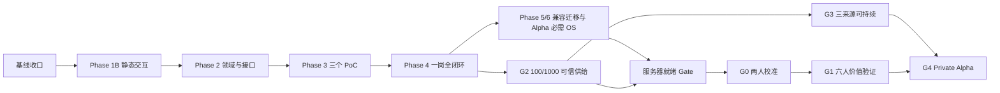

# Aijob 求职 OS 2.0 → Private Alpha 严格开发总计划

- 状态：Phase 1A、Phase 1B accepted；当前只批准 Phase 2
- 初版日期：2026-08-04
- 严格化日期：2026-08-05
- 决策者：coco
- 当前分支：`codex/career-os-phase-1`
- 关联决策：[ADR-0029](../decisions/0029-official-source-catalog-trust-boundary.md)、[ADR-0030](../decisions/0030-adopt-job-centric-career-os-and-interaction-first-integration.md)
- 动态进度：[MVP 路线与当前决策面板](../06-mvp-roadmap.md)

本文只维护阶段定义、依赖、接口边界和 Gate。真实分母、当前唯一目标与下一决定只写入路线图；当前分支、未提交状态和接手入口只写入交接；每阶段命令、截图、风险和继续/修改/回退/停止决定写入独立证据。任何工程完成都不能把产品证据从 `E0` 自动提升。

## 1. 终点、流程与工期基线

终点是通过 `G4 Private Alpha`，不是页面完成、本地可运行或抓到更多岗位。当前可信供给仍为 22 岗 / 3 家企业，产品证据仍为 `E0`。



单人开发初始估算约 108–177 个有效人日，不含参与者招募、云资源采购、审批和 7 天/72 小时强制观察窗口。每个 Gate 后重估，不把人日区间当发布日期。

| 阶段 | 人日 | 唯一结果 | 当前状态 |
|---|---:|---|---|
| 基线收口 | 1–2 | 干净、可追溯的 Phase 1A 基线 | 已完成 |
| Phase 1B | 4–6 | JD 能力与定制简历静态交互 Gate | 已通过 |
| Phase 2 | 8–12 | 数据模型、契约、迁移和删除覆盖 | 当前唯一目标 |
| Phase 3A Case PoC | 5–7 | 固定岗位版本的一岗一档 | 未开始 |
| Phase 3B Resume V2 PoC | 10–14 | 两模板、编辑、确认、DOCX/打印 | 未开始 |
| Phase 3C Interview PoC | 8–12 | 文字面试、反馈、复盘及模板降级 | 未开始 |
| Phase 4 | 10–15 | 单岗位端到端闭环 | 未开始 |
| Phase 5 | 4–6 | 旧页面兼容收口 | 未开始 |
| Phase 6 | 8–12 | Private Alpha 必需的完整 OS 入口 | 未开始 |
| G2/G3 供给 | 30–60 运营/工程人日 | 100/1000 与三来源连续运行 | 未开始 |
| 服务器就绪 | 10–15 | 邀请环境、安全、恢复和监控 | 未开始 |
| G0/G1/G4 | 10–16 | 2 人校准、6 人验证和 Alpha 总验收 | 未开始 |

## 2. 执行纪律与冲突收口

### 2.1 四层事实源

1. 本计划：稳定阶段、依赖、接口和 Gate。
2. `docs/06-mvp-roadmap.md`：当前唯一目标、真实分母、Gate 状态和下一决定。
3. `docs/handoffs/current.md`：当前分支、未提交状态、最近验收和接手入口。
4. `docs/evidence/**`：每阶段命令、测试、视觉证据、风险、回退和决定。

同一种事实只能在一层维护；分支名、提交名或纵向切片名称不代表 Gate 已通过。

### 2.2 已收口冲突

- Phase 1A 已通过但曾位于脏工作树：已复验并以独立提交 `7bb2140` 冻结，再实施 Phase 1B。
- `G2` 旧称冲突：产品建设只使用 `Phase 1A–6`；`G0–G5` 只表示验证 Gate，编号不表示时间顺序。当前 `G2` 指“Career OS 本地完整闭环 + Private Alpha 100/1000 供给门”。
- 旧 `300–500` 岗位范围：统一改为从已通过 G2 的 1000 岗目录中冻结的正式研究子集，不再作为供给总门槛。
- Phase 6 与扩容顺序：Phase 4 通过后同时开放 Phase 5/6 产品收口和 G2/G3 供给两条工作流，最终在服务器就绪 Gate 汇合。
- 暂无服务器：先做基础设施无关部署包；达到供给 Gate 后仍须 coco 明确授权供应商、地区、预算和数据路径。未授权时服务器 Gate 保持未通过。
- `pending_review` 与邀请供给：本地可见不等于参与者可用；未完成准入的岗位不能计入 G4 分母，公共 `/v1/jobs` 继续为空。
- 2026-08-05 `audit:ci` 冲突：仓库旧 override 固定到有漏洞的 `fast-uri` 3.1.4/4.1.1，已最小升级到 3.1.5/4.1.2 并恢复安全门。

### 2.3 每个纵向切片的固定流程

每项限制为 0.5–2 人日；单人开发同时只允许一个 `in_progress`：

1. 写清用户任务、非目标、数据与风险。
2. 固定输入、输出、接口、错误和回退。
3. 先补测试或代表性离线夹具。
4. 实现一个可审查纵向切片。
5. 运行局部测试，再运行阶段工程门。
6. 完成 1920/1280/768/320、200% 缩放、键盘和必要安全检查。
7. 更新阶段证据。
8. 只允许“继续、修改、回退、停止”四种决定。

`.claude/`、`.data/`、密钥、令牌、简历原文、本地数据库和下载产物始终排除于读取、暂存和提交范围。

## 3. 固定产品与交互架构

### 3.1 产品使命与边界

Aijob 是可信官方岗位驱动的完整求职 OS，不是岗位信息流、简历生成器、自动投递工具或传统后台。完整链路为：

```text
可信企业与官方岗位
→ JD 资格与能力拆解
→ 用户经历证据确认
→ 岗位定制中文简历
→ 官方页面由用户自行投递并记录进展
→ 文字模拟面试
→ 复盘与引用式经验沉淀
→ 删除全部个人数据
```

不得抓取综合招聘平台，不绕过登录或访问控制，不自动填写或投递，不把未说明字段补写，不合并资格、证据和偏好为总分，不在用户确认前创造经历或数字。

### 3.2 统一壳层和路由

唯一结构为 `GlobalSidebar + UtilityBar + MainCanvas + ContextInspector`。全局侧栏固定为`今日 / 发现岗位 / 我的求职 / 简历资产 / 面试训练 / 经验库`，底部为`数据与设置`；单岗位标签固定为`概览 / JD能力 / 定制简历 / 投递 / 面试 / 复盘`。

```text
/today
/jobs
/applications
/applications/:caseId/overview
/applications/:caseId/requirements
/applications/:caseId/resume
/applications/:caseId/application
/applications/:caseId/interview
/applications/:caseId/debrief
/resumes
/interviews
/knowledge
/settings/data
```

筛选、排序、视图、侧览、要求和简历区块进入 URL；本机非敏感 UI 偏好才允许版本化 localStorage。岗位列表、看板首屏不得加载简历编辑器或面试模块。

### 3.3 三个概念图的约束

三张 PNG 只提供布局与信息层级，解释以[概念图契约](../evidence/product/career-os-v2/README.md)为准：

1. [概念 01](../evidence/product/career-os-v2/concept-01-application-board.png)：采用统一壳层、看板和侧览；拒绝“匹配良好/中/差”。
2. [概念 02](../evidence/product/career-os-v2/concept-02-job-workspace.png)：要求分组、原文和证据检查器；岗位事实、用户证据、未知项分开。
3. [概念 03](../evidence/product/career-os-v2/concept-03-resume-studio.png)：结构导航、A4 预览和逐段建议；拒绝独立简历品牌与自动写入。

合法证据状态只有`已有证据 / 证据待补充 / 用户尚未确认`。任何“已验证”“证据不足”等文案必须按契约映射，不能发明第四种业务状态。

### 3.4 开源吸收纪律

OpResume、JadeAI、resume-design、LuJie CareerKit、JobSync、OfferU、Resume Matcher、FaceTomato、Plane、Twenty、Linear 和 Attio 只提供组件或行为参考。只有完成许可证、固定提交、网络副作用、认证、持久化和遥测审计后的 MIT/Apache 纯组件可选择性移植；AGPL、许可证不清、框架冲突和独立后端只学习行为。不得整仓 Fork、Git 子模块或引入第二套领域模型。

## 4. 阶段实施计划

### 基线收口：Phase 1A 交付冻结

已完成并记录于[Phase 1A 验收](../evidence/product/career-os-v2/phase-1a-workspace-shell-acceptance-2026-08-04.md)：功能旗标关闭保持 `ProductShell`，开启进入 `WorkspaceShell`；URL、侧览、焦点和本机 UI 偏好可恢复。退出决定：继续。

### Phase 1B：JD 能力与定制简历静态交互

已完成并记录于[Phase 1B 验收](../evidence/product/career-os-v2/phase-1b-static-workspaces-acceptance-2026-08-05.md)。

JD 能力页：

- `/applications/:caseId/requirements` 分为硬条件、职责能力、未知待确认。
- 每项显示静态官方原文、来源和三态；`?requirement=<id>` 恢复选择。
- 检查器展示原文、证据和静态下一步；键盘可选，关闭后焦点返回，320px 为全宽抽屉。
- 不保存用户事实、不调用接口、不访问真实岗位。

定制简历页：

- `/applications/:caseId/resume` 包含结构导航、A4 主预览和当前区块建议；`?block=<id>` 恢复选择。
- 接受只改当前会话预览；编辑后采用可确认/取消；拒绝保留原文并隐藏建议；三者均可撤销。
- 真实刷新恢复静态初始建议，不使用 localStorage 伪装业务持久化。
- 不引入富文本、拖拽、数据库或 AI。

退出决定：继续进入 Phase 2；不得回头把静态状态冒充持久化业务能力。

### Phase 2：领域模型、契约和迁移

只使用现有 PostgreSQL、模块化单体、认证、CSRF、任务队列和 `match-worker`；不新增数据库、Redis、消息总线、认证或 AI SDK。

#### 2A ApplicationCase

新增 `application` schema：

- `application_cases`：owner、owner epoch、稳定岗位 ID、固定岗位版本、阶段、结果、乐观修订号、TTL、结束时间；同一 owner/稳定岗位只允许一个未结束 Case。
- `case_events`：追加式阶段和行为事件，Case 内序号唯一，禁止原地更新。
- `case_requirement_states`：要求三态、用户备注、修订号。
- `case_requirement_evidence_links`：连接要求与已确认证据。
- `case_questions`：用户主动补充的未知问题。
- 岗位版本升级必须显式执行并记录旧/新版本；旧简历和面试材料继续固定原版本。

#### 2B Resume Document V2

- 新增 `resume_documents`，区分基础简历与 Case 派生简历。
- 既有不可变 `resume_document_revisions` 增加文档归属与文档内修订号；旧 V1 行保持不变。
- V1 只通过转换器读取；首次编辑才创建 V2 修订。
- 模板和章节顺序使用独立不可变布局修订；换模板不得改变语义内容或证据 ID。
- Case 派生简历固定基础简历修订、岗位版本和证据修订。

#### 2C Interview、Debrief、Knowledge

- `interview_sessions` 固定 Case、岗位版本、模式和输入证据版本。
- `interview_turns` 追加保存问题、回答和追问。
- `interview_feedback` 保存结构化反馈和证据引用。
- `debriefs` 只保存表达问题、证据缺口和练习计划；用户确认后才能转成经历表达。
- `knowledge_clips` 只保存 URL、标题、短摘要、适用场景、核验时间和用户笔记，不抓全文。
- 新任务类型继续使用 PostgreSQL 队列和 `match-worker`。

所有实体具备 owner 隔离、owner epoch、最长 30 天 TTL、删除墓碑和迟到任务拒绝；导出最长 24 小时，无正文审计最长 90 天。迁移只做 additive/expand；旧应用在新 Schema 下继续运行。退出 Gate：跨 owner、删除、到期、并发修订和迟到任务 PostgreSQL 集成测试通过。

### Phase 3A：ApplicationCase PoC

- 从岗位侧览以幂等键创建 Case，固定岗位版本并提供确定性差异。
- 只有用户显式确认才能升级 JD 版本。
- 阶段：`interested / preparing / applied / interviewing / resolved`。
- 结果：`offer / rejected / withdrawn / expired / unknown`。
- 旧决定映射：`saved → interested`、`preparing_to_apply → preparing`、`applied → applied`、`abandoned → resolved/withdrawn`、`undecided` 不创建。
- 新 Case 为真源；旧接口只兼容可无损表示状态，其他返回明确冲突并引导新工作台。

### Phase 3B：Resume V2 PoC

- 使用结构化表单，不引入通用富文本。
- 章节排序必须有可访问的上移/下移按钮，首轮不依赖拖拽。
- 模板固定为中文经典单栏、中文紧凑技术。
- A4 预览用浏览器布局；PDF 走打印，不增加服务器 PDF。
- DOCX 导出器接收 Resume V2 DTO。
- AI 建议复用现有 tailoring 与逐段确认；无 AI 使用模板建议。
- 接受、编辑后采用、拒绝都生成可追溯状态，不覆盖原修订。

### Phase 3C：文字面试 PoC

- 模板模式根据固定 JD 要求生成问题与准备提示。
- 受控 AI 只走现有兼容层，用模拟端点覆盖正常、超时、限流、无效 Schema 和无效证据引用。
- 当前阶段不调用真实 AI；Private Alpha 默认仍为模板模式。
- 问答与反馈必须引用同一 Case 的岗位版本和用户已确认事实。
- 复盘不能创造经历。

三个 PoC 必须能独立运行和删除；不得出现第二套认证、数据库、队列、AI SDK、岗位真源或事实库。

### Phase 4：一岗全闭环

使用离线岗位夹具与合成用户材料把静态工作区接入内部 API：

```text
岗位侧览 → 创建 Case → 核对 JD 能力 → 选择/补充已确认证据
→ 创建岗位简历 → 逐段接受/编辑/拒绝 → DOCX/打印
→ 打开官方链接 → 用户手动标记已投递 → 文字面试
→ 复盘与知识引用 → 删除全部个人数据
```

打开官方链接绝不自动记为投递；AI 关闭时仍完成核对、编辑、导出、投递记录、模板面试和复盘；加载、空、失败、过期、冲突和重试均有明确 UI；删除后刷新、重新登录、迟到任务和恢复备份不得复活。退出 Gate：自动 E2E 与人工浏览器验收同时通过并形成证据包。

### Phase 5：兼容迁移

- `/resume` 兼容进入 `/resumes`；`/recommendations` 收口到 `/applications`；`/insights` 按岗位/Case 进入 `requirements`。
- 可唯一关联的旧 tailoring run 连接 Case；无法确定归属的保留旧只读页。
- 功能旗标关闭仍可回到旧壳层。
- 只有新闭环、安全和删除 Gate 全部通过才删除重复组件；G4 前不做数据库 contract migration。

### Phase 6：Private Alpha 必需 OS

- `/today`：基于 Case 阶段、截止时间和用户记录生成确定性下一步，不发站外通知。
- `/applications`：多 Case 列表/看板、筛选、排序、侧览和时间线。
- `/resumes`：基础简历、Case 派生简历、模板和导出历史。
- `/interviews`：跨 Case 文字练习历史和待练习项。
- `/knowledge`：用户主动保存的引用式经验，不抓正文、不做社区。
- `/settings/data`：数据范围、过期时间、导出和全部删除。
- 公司研究只展示官方链接和用户短笔记，不扩展为新采集系统。

退出 Gate：所有入口复用同一壳层、owner 和 Case；首屏不加载简历编辑器或面试模块；320px、200% 缩放和键盘全流程可用。

## 5. G2/G3 可信供给与可持续性

只有 Phase 4 通过后才能恢复真实来源工作；每个真实批次仍需 coco 明确授权和既有 `--confirm-live`。

检查点固定为：

- `40 家 / 400 岗`：验证容量来源族与增速，通过后才灰度统一 12 小时刷新。
- `70 家 / 700 岗`：复核 SME、职能、城市和人工来源占比，优先补结构缺口。
- `100 家 / 1000 岗`：通过硬 Gate；随后以 `110/1100` 作为运行缓冲。

硬指标：SME 企业 ≥50%、SME 岗位 ≥40%；产品、运营、工程、数据与 AI 各 ≥100，其余 8 个职能各 ≥15；北京、上海、深圳、广州、杭州、成都、武汉、南京各 ≥40 条地点已知岗位；人工/浏览器来源企业 ≤20%、岗位 ≤10%；追溯率与未知诚实率 100%；关键字段准确、链接可用、新鲜度 ≥95%；静默失败、幂等重复、误合并为 0。

G3 定义：至少 3 个通过准入的确定性 canonical 来源连续运行 7 天，每 12 小时完成应到刷新，失败互相隔离，无静默空结果、重复触网或目录污染。历史证据不回写为新 Gate 通过。

## 6. 服务器就绪 Gate

第一步先完成基础设施无关部署包：可重复构建镜像、迁移作业、五个数据库角色、配置校验、密钥引用、监控、备份/恢复和回滚脚本。第二步必须在供给 Gate 后取得 coco 对供应商、地区、预算和数据路径的明确授权；不得自动采购或部署。

邀请环境必须通过：

- 私有 HTTPS 邀请入口、哈希邀请凭证、Secure/HttpOnly Cookie、CSRF 和 owner 对象鉴权。
- 持久化邀请失败限流，不依赖单进程内存。
- 简历解析在非特权、无外网、资源受限的独立部署单元。
- PostgreSQL 恢复目标 `RPO ≤24h、RTO ≤8h`，并证明删除不会因恢复复活。
- 原文确认后立即删除，异常最长 24 小时；结构化数据最长 30 天。
- 1000 岗、20 并发邀请会话下核心读取 p95 ≤750ms、错误率 <1%。
- 日志、告警和错误正文不含简历、联系方式、提示词、密钥或完整模型输入。
- AI 默认关闭；无供应商数据处理结论时只能用模板。

## 7. G0、G1 与 G4

### G0：2 人协议校准

使用同一候选构建、脚本与冻结岗位子集，验证招募条件、术语、计时、外链返回、记录表和 72 小时联系路径。样本不计正式通过率；任务或界面实质修改后必须重做。

### G1：6 人正式验证

从通过 G2 的 1000 岗中冻结 300–500 条代表性研究子集；6 人至少覆盖 4 个岗位方向，同方向最多 2 人。

通过条件：

- 至少 4/6 在 20 分钟内找到 3 个愿意认真考虑且无已知硬冲突的岗位。
- 至少 5/6 正确区分资格冲突、简历暂未体现、岗位信息未知、偏好不符。
- 至少 3/6 在 72 小时内完成高质量决定并记录理由。
- 其中至少 2 人自报在官方页面投递；外链点击不计投递。

硬条件漏检、错误劝退、虚构或未确认经历、未确认事实参与结论、跨 owner、隐私或安全事件任一发生即失败。AI 对照不是 G1 前提；只有 6 人全部选择参加、供应商 Gate 通过且至少 4/6 优于模板并无新增事实错误，才允许后续远程启用。

### G4：Private Alpha 总验收

只有 Phase 1B–6、G2、G3、服务器就绪、G0、G1、至少 30 个高风险三轴金标、删除/恢复/回滚/来源暂停/故障隔离演练、邀请制隐私与投诉止损流程全部通过，才允许扩大邀请。

## 8. Owner 保护接口与公共类型

新增 API 使用 `Cache-Control: no-store`；写操作要求 CSRF，创建要求幂等键，更新要求 `expectedRevision`。跨 owner 统一返回不可枚举 404，版本冲突返回标准 Problem Details。

核心接口族：

- `/v1/application-cases`：列表、创建、详情。
- `/v1/application-cases/:caseId/transitions`：阶段与结果事件。
- `/v1/application-cases/:caseId/job-version-diff` 与 `/job-version-upgrades`。
- `/v1/application-cases/:caseId/requirements`：状态、证据连接和未知问题。
- `/v1/resume-documents` 与 `/revisions`。
- `/v1/application-cases/:caseId/resume-tailorings` 与 `/resume-exports`。
- `/v1/application-cases/:caseId/interview-sessions`。
- `/v1/application-cases/:caseId/debrief`。
- `/v1/knowledge-clips`。

固定公共类型：

```ts
type CaseStage = "interested" | "preparing" | "applied" | "interviewing" | "resolved";
type CaseOutcome = "offer" | "rejected" | "withdrawn" | "expired" | "unknown";
type RequirementEvidenceState = "confirmed" | "needs_work" | "unconfirmed";
type ResumeSuggestionDecision = "pending" | "accepted" | "edited" | "rejected";
type InterviewMode = "template" | "controlled_ai";
```

现有匹配结果不被覆盖；页面三态只是证据状态展示映射，并保留原始依据。公共岗位接口、准入投影、来源白名单和可见性不因 Career OS 改动。

## 9. 测试、发布与回退

### 9.1 每个 PR 的自动工程门

```text
git diff --check
pnpm lint
pnpm typecheck
pnpm test
pnpm build
pnpm audit:ci
CI Secret 扫描、文档链接/Schema 检查、数据库兼容验证
```

必须覆盖 URL 刷新/前进/后退、非法 Case/标签、焦点恢复；Case 唯一性、版本固定/升级、并发冲突；V1 转换/V2 首次编辑/区块稳定/换模板；建议四态与 AI 降级；面试无效 Schema/证据/超时/限流/提示注入；跨 owner、CSRF、会话、TTL、墓碑、迟到任务与恢复；来源 SSRF/重定向/静默空/幂等/配额；1000 岗游标、冻结候选与部署负载。

PostgreSQL 集成测试未实际运行时必须写“未执行”，不得写“通过”。Phase 2 迁移 Gate 没有隔离 PostgreSQL 结果不能通过。

### 9.2 人工与视觉 Gate

1920、1280、768、320 CSS px；200% 缩放；键盘全流程；可见焦点；状态通知；无整页横向滚动；控制台无新增 warning/error。非简历路由初始包不得相对 Phase 1A 增长超过 10%，否则拆包或记录接受理由。

### 9.3 发布与回退

数据库只用 `expand → migrate → contract`；G4 前只做 expand/migrate。`VITE_CAREER_OS_V2` 保持紧急回退；应用回退不得删除新数据，无法安全回滚的迁移采用前向修复。顺序固定为内部 owner → G0 → G1 → G4 后扩大邀请。任一安全守护失败，关闭相关旗标、暂停新增参与者并回到最早缺失证据阶段。

## 10. 默认假设与当前唯一下一步

- 单人/单 Agent 严格串行；Phase 4 前不恢复真实供给扩容。
- 当前请求不授权真实招聘来源、真实 AI、服务器采购、部署、参与者招募或真实简历。
- 主计划终点为 G4；公开 Beta、备案、公开运营和商业化只保留为 G5 后续 Gate。
- 工期是有效工作量，不包含外部审批、采购、招募和观察期。

当前唯一目标是 **Phase 2**，且第一切片只能是“领域契约与迁移设计包”：先盘点现有迁移、owner/epoch/TTL/墓碑、任务队列和 Resume V1 表，再冻结 ApplicationCase/Resume V2/Interview 的 Schema、API Problem Details 与删除矩阵；未完成设计审查前不写迁移。
